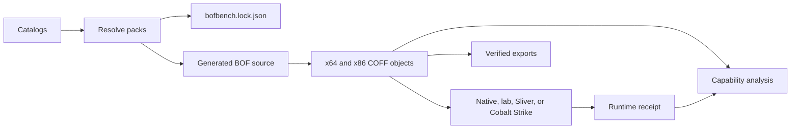
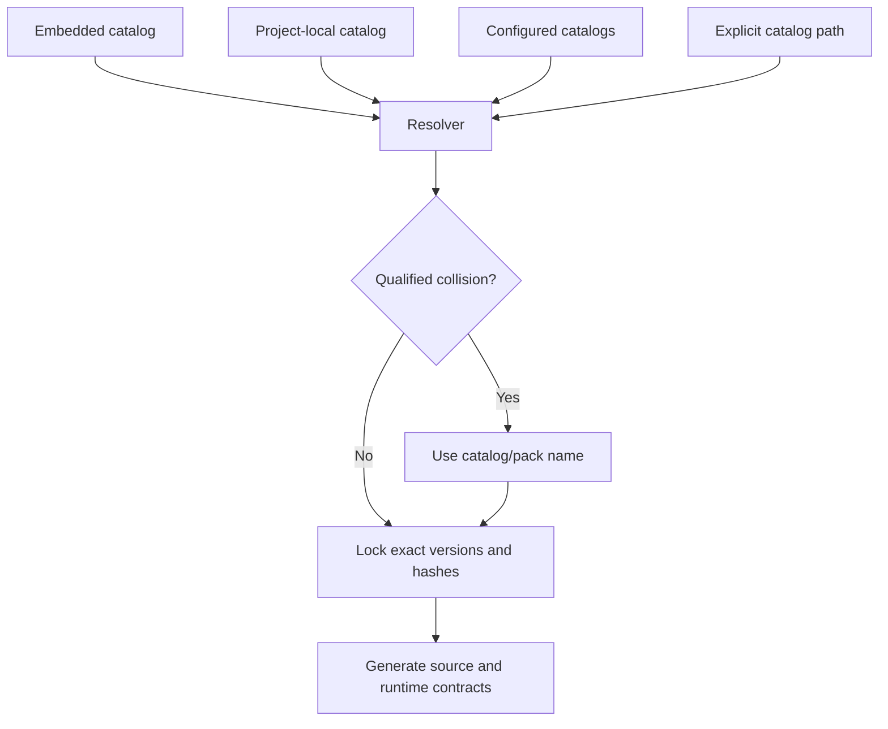
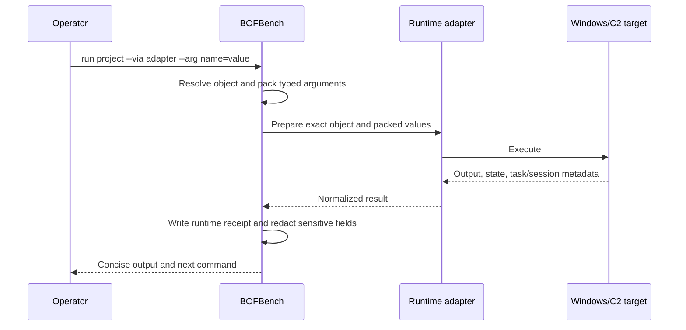

# How BOFBench Fits Together

BOFBench treats BOF development as one operator loop rather than unrelated compiler, loader, and C2 tasks:

```text
new → add packs → build → analyze → run → export
```

## The core objects

| Term | Meaning | Created by |
| --- | --- | --- |
| **Catalog** | A collection of versioned capability packs | Embedded in BOFBench or configured with `catalog add` |
| **Pack** | Source fragments, typed arguments, analysis expectations, runtime support, and optional cleanup | A public or private catalog author |
| **Project** | A composition of one or more resolved packs plus generated BOF source | `bofbench new` and `bofbench add` |
| **Lock** | Exact pack versions, hashes, arguments, effects, and cleanup relationships | Project resolution |
| **Object** | Compiled Windows COFF `.o` for x64 or x86 | `bofbench build` |
| **Analysis** | Structural facts and inferred operator capabilities | `bofbench analyze` |
| **Receipt** | Normalized runtime result tied to an exact object hash | `bofbench run` or `pack prove` |
| **Export** | Verified raw or C2-specific operator package | `bofbench export` |



## Pack composition and the lock

`new` selects the initial packs. `add` composes more capability into the same project:

```bash
bofbench new field-survey --pack host-discovery,process-tree
bofbench add bofs/field-survey network-neighbor-inventory
bofbench pack show process-tree
bofbench build bofs/field-survey
```

Composition happens in declared dependency order, suppresses duplicate fragments, and records the resolved result in `bofbench.lock.json`. Runtime values such as a PID, path, hostname, filter, or byte limit remain typed arguments; changing them normally does not require recompilation.



## Static prediction and observed behavior

Analysis answers five operator questions:

- **Can do:** primitives and complete behavior chains supported by object evidence.
- **Needs:** arguments, privilege, network, domain, and host conditions.
- **Effects:** reads, writes, process execution, persistence, credential access, and remote reach.
- **Works with:** loaders and runtime adapters supported by the object and pack contract.
- **Observed:** output confirmed by a receipt whose object hash exactly matches the analyzed object.

Static analysis does not claim that an operation already happened. Runtime output does not become evidence for a different build merely because the project name is the same.

## Runtimes share one contract



Native, remote lab, Sliver, and Cobalt Strike adapters differ in transport and session semantics, not in the project argument contract.

## Test versus prove

`pack test` is static and portable:

```bash
bofbench pack test process-tree
bofbench pack test --all
```

It validates manifests, builds declared architectures, checks analyzer expectations, and verifies exports. An unavailable compiler is reported as unavailable coverage.

`pack prove` exercises manifest-declared runtime cases:

```bash
bofbench pack prove process-tree --via lab --lab devbox
```

Proof can capture output fields for later cleanup steps and independently verify named state. The disposable fixture makes acceptance repeatable; it is not a restriction in the operational pack.

## Choose the next path

- New operator: [Quickstart](quickstart.md).
- BOF developer: [Author an External Pack](pack-authoring.md).
- Analyst: [Read a Capability Report](report-interpretation.md).
- External-object user: [Analyze Third-Party BOFs](third-party-analysis.md).
- Windows operator: [Lab Architecture and Setup](lab-setup.md).
- C2 operator: [Runtime Adapters](runtime.md).
