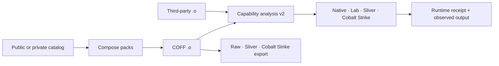

<div class="bb-hero">
  <div>
    <div class="bb-kicker">Capability-first BOF development</div>
    <h1>BOF<span>Bench</span></h1>
    <p class="bb-hero-copy">Compose real capabilities, explain any COFF object, and run the result through Windows, Sliver, or Cobalt Strike from one operator workflow.</p>
    <div class="bb-actions">
      <a href="quickstart/">Build your first BOF</a>
      <a href="analysis/">Analyze any .o</a>
      <a href="windows-lab/">Connect a Windows lab</a>
    </div>
  </div>
</div>

<div class="bb-proof">
  <div><strong>244 packs</strong><span>90 public · 154 private</span></div>
  <div><strong>x64 + x86</strong><span>separate native loaders</span></div>
  <div><strong>4 runtimes</strong><span>native · lab · Sliver · CS</span></div>
  <div><strong class="bb-impact">50 operations</strong><span>linear · routed · async · bounded retry</span></div>
</div>

# The operator loop

```text
new → add packs → build → analyze → run → export
```

```bash
bofbench new portable-survey --pack deep-survey
bofbench build bofs/portable-survey --arch x64
bofbench analyze bofs/portable-survey
bofbench run bofs/portable-survey --via lab --lab dedicated \
  --arg process_filter=lsass \
  --arg result_limit=5
bofbench export bofs/portable-survey --for sliver
```

The project lock records the resolved pack versions, source hashes, arguments, and cleanup companions. The analyzer leads with what the BOF can do, what it needs, its effects, its typed arguments, and which runtimes support it. Loader internals and report paths stay available without taking over the workflow.



## Analyze a public BOF without rebuilding it

```bash
bofbench analyze arsenal/trustedsec-sa/SA/whoami/whoami.x64.o
bofbench arsenal search arsenal/trustedsec-sa --can token
```

Function-local API correlation distinguishes isolated primitives from stronger behavior chains. A token query is not reported as impersonation unless the object also contains the duplicate-and-apply sequence; process access is not called injection without allocation, write, and execution steps.

Compare both architectures across an entire corpus:

```bash
bofbench arsenal matrix arsenal/trustedsec-sa
bofbench arsenal search arsenal/trustedsec-sa \
  --api RpcBinding --chain remote_registry --loader compatible
```

Dependency-aware operations prepare and execute independent ready steps concurrently while preserving exact contracts, captures, resume, and reverse-topological cleanup:

```bash
bofbench operation graph internal/ipc-dependency-matrix --expand
bofbench operation run internal/ipc-dependency-matrix \
  --via lab --lab devbox --parallelism 4
```

Version-7 operations can keep bounded watchers active while a dependent action waits only for a declared readiness result. Version 8 can retry only a named, complete transient result, with a finite deterministic delay:

```bash
bofbench operation run internal/registry-change-observe \
  --via lab --lab devbox --parallelism 4 <typed arguments>
bofbench operation watch runs/<run-id>/operation.json --follow
bofbench operation cancel runs/<run-id>/operation.json --cleanup
```

Native and lab tasks stream structured progress into atomically readable receipts. A trigger is not scheduled until its watcher emits the exact `status=ready` contract. Retry never guesses that a crash, timeout, partial response, or incomplete C2 task is transient, and cancellation interrupts pending backoff immediately.

## Use the same interface at different depths

The embedded catalog provides read-only discovery packs. A local or Git-backed catalog can add deeper token, process-memory, persistence, collection, and explicit-target remote execution packs without rebuilding BOFBench:

```bash
bofbench catalog add ~/bofbench-packs-internal --name internal
bofbench pack search token
bofbench pack show internal/token-impersonation
```

Continue with the [Quickstart](quickstart.md), [Portable Lab Profiles](lab-profiles.md), [Capability Packs](packs.md), or [Behavioral Analysis](analysis.md).
