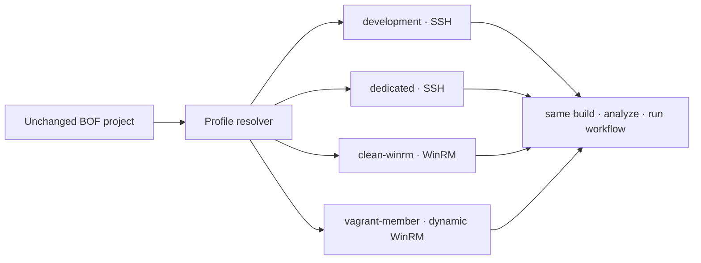

# Portable Lab Profiles

Lab profiles separate a BOF project from the Windows machine that runs it. A project can move from a development VM to a clean dedicated system without changing source, rebuilding BOFBench, or storing authentication details in the repository.



## Register an existing Windows host

An SSH alias is enough:

```bash
bofbench lab add development \
  --provider existing \
  --transport ssh \
  --host windows-dev \
  --remote-root 'C:\bofbench'
```

Or store the direct connection fields:

```bash
bofbench lab add dedicated \
  --provider existing \
  --transport ssh \
  --host 10.0.0.50 \
  --user operator \
  --port 22 \
  --identity ~/.ssh/bofbench-dedicated \
  --known-hosts ~/.ssh/known_hosts \
  --remote-root 'C:\bofbench'
```

Host-key verification remains enabled. BOFBench never adds an insecure SSH option. `identity_file` and `known_hosts` are paths; key contents are not copied into the profile.

## Clone a profile when moving systems

Cloning keeps the transport, remote root, build behavior, and runtime selector while replacing only machine-specific values:

```bash
bofbench lab add dedicated \
  --from development \
  --host 10.0.0.50 \
  --user operator \
  --identity ~/.ssh/bofbench-dedicated

bofbench lab show dedicated
bofbench lab bootstrap --lab dedicated
bofbench lab use dedicated
```

The original profile remains available. Switching back is one command:

```bash
bofbench lab use development
```

## See and select targets

```bash
bofbench lab list
bofbench lab show dedicated
bofbench lab use dedicated
bofbench lab use dedicated --project bofs/survey
```

The last form writes only the profile name to `bofs/survey/.bofbench/lab.json`. Host, username, ports, key paths, and passwords stay in the global configuration.

Selection order is deterministic:

1. `--lab <name>` on the current command.
2. `BOFBENCH_LAB=<name>`.
3. The project-local profile name.
4. The active global profile.
5. The only configured profile when exactly one exists.
6. Otherwise BOFBench stops and prints the available names.

No hostname is built into BOFBench.

## Where profiles live

Set a portable configuration root when desired:

```bash
export BOFBENCH_CONFIG_HOME="$HOME/.config/bofbench"
```

Profiles then live in `$BOFBENCH_CONFIG_HOME/labs.json`. Without that variable, BOFBench uses the platform configuration directory.

```json
{
  "schema": "bofbench.labs",
  "schema_version": 4,
  "active": "dedicated",
  "profiles": {
    "dedicated": {
      "provider": "existing",
      "topology": "standalone",
      "transport": "ssh",
      "host": "10.0.0.50",
      "user": "operator",
      "port": 22,
      "identity_file": "~/.ssh/bofbench-dedicated",
      "known_hosts": "~/.ssh/known_hosts",
      "remote_root": "C:\\bofbench",
      "build_mode": "auto",
      "sliver_session": "DEDICATED-BOF"
    }
  },
  "active_topology": "dedicated-standalone",
  "topologies": {
    "dedicated-standalone": {
      "execution": "development",
      "target": "dedicated"
    }
  }
}
```

Schema version 4 retains ordinary `existing` and `vagrant` profiles and adds a secret-free `proxmox` block. Version-2 and version-3 files migrate automatically, with the original retained as a versioned backup.

The file is written with user-only permissions. Passwords and private-key contents are rejected by design because the schema has no fields for them.

## Reuse named multi-host topologies

Topologies contain profile names only. They let the same proof contract select an execution host, target host, and optional domain controller without copying any host or authentication data into a BOF project:

```bash
bofbench lab topology add dedicated-standalone \
  --execution devbox \
  --target dedicated

bofbench lab topology add dedicated-domain \
  --execution devbox \
  --target domain-member \
  --domain-controller domain-dc

bofbench lab topology list
bofbench lab topology status dedicated-domain
```

Run topology-aware proofs directly:

```bash
bofbench pack prove --all --catalog internal \
  --via lab --topology dedicated-domain
```

Pack schema version 4 can fill omitted values from `target.computer_name`, `domain_controller.computer_name`, `domain.name`, and `domain.base_dn`. State checks run on the role named by the pack, so a remote action is verified on the target rather than on the execution host.

## Prepare a fresh machine

Print the one-time elevated PowerShell for the transport you want:

```bash
bofbench lab setup-script --transport ssh
bofbench lab setup-script --transport winrm
```

Run the printed block in an elevated PowerShell window on the new Windows host. Then register and bootstrap it:

```bash
bofbench lab add fresh \
  --provider existing \
  --transport ssh \
  --host fresh-windows \
  --user operator

bofbench lab bootstrap --lab fresh
bofbench lab status --lab fresh
```

Bootstrap is idempotent. It probes Windows version, architecture, elevation, free disk, compilers, x64/x86 loaders, debugging tools, BOFBench version, Sliver support, and snapshot support. The Windows CLI and loaders are uploaded only when hashes differ.

## Use WinRM instead of OpenSSH

```bash
bofbench lab add clean-winrm \
  --provider existing \
  --transport winrm \
  --host 10.0.0.60 \
  --user operator \
  --port 5985
```

Supply the password at runtime, never in JSON:

```bash
export BOFBENCH_LAB_CLEAN_WINRM_WINRM_PASSWORD='...'
bofbench lab status --lab clean-winrm
```

If the environment variable is absent and BOFBench has an interactive terminal, it prompts without echo. HTTPS WinRM profiles use `--winrm-https` and default to port 5986.

## Choose where compilation happens

Each profile has one build mode:

| Mode | Behavior |
| --- | --- |
| `auto` | Use MSVC or MinGW on Windows when available; otherwise build locally and upload the object. |
| `remote` | Require a supported compiler on the Windows host. |
| `local` | Build on the operator system, upload the `.o`, and execute with the remote loader. |

```bash
bofbench lab add portable-build --from dedicated --build-mode local
bofbench run bofs/portable-survey --via lab --lab portable-build \
  --arg process_filter=lsass --arg result_limit=5
```

A compiler is therefore optional on a fresh dedicated Windows system.

## Automatic runtime bootstrap

Lab runs default to `--bootstrap auto`:

```bash
bofbench run bofs/portable-survey --via lab --lab fresh
```

`auto` quietly uses a matching runtime and deploys a missing or changed one. Use `always` to force a hash check and deployment pass, or `never` when the machine must remain untouched:

```bash
bofbench run bofs/portable-survey --via lab --lab fresh --bootstrap always
bofbench run bofs/portable-survey --via lab --lab fresh --bootstrap never
```

Objects, receipts, and collected results are isolated under the profile name and run ID.

## Vagrant profiles

Vagrant profiles keep only the Vagrantfile and optional machine name. BOFBench asks Vagrant for current WinRM host, forwarded port, username, and generated password at execution time.

```bash
bofbench lab add disposable \
  --provider vagrant \
  --vagrantfile lab/Vagrantfile \
  --machine workstation \
  --topology standalone

bofbench lab up --lab disposable
bofbench lab bootstrap --lab disposable
bofbench lab snapshot clean --lab disposable
bofbench lab restore clean --lab disposable
```

Forwarded ports may change between `up` operations without requiring a profile edit.

## Proxmox profiles

Proxmox profiles record a VMID, node, storage, bridge, template VMID, guest CIDR, and an external token-secret source. They never record the token secret or Windows password:

```bash
bofbench lab add win11-dev \
  --provider proxmox \
  --proxmox-prep ~/.config/bofbench/proxmox-lab.json \
  --proxmox-vmid 4110 \
  --proxmox-template-vmid 4101 \
  --transport ssh \
  --user Administrator \
  --identity ~/.ssh/bofbench-windows \
  --build-mode remote

bofbench lab up --lab win11-dev
bofbench lab provider status --lab win11-dev
bofbench lab bootstrap --lab win11-dev
bofbench lab snapshot clean --lab win11-dev
```

When a Proxmox profile's VM is absent, `lab up` clones the configured template into the profile VMID, places it in the configured pool, waits for the UPID, starts it, and discovers the guest address through the QEMU agent. If the API is reachable only from the hypervisor network, `ssh_proxy` is used both for the API tunnel and the guest SSH jump. Every lifecycle action writes a secret-free `bofbench.provider-receipt`.

See [Proxmox-Native Labs](proxmox-labs.md) for bridge isolation, template construction, pool permissions, multi-role topologies, and teardown.

## Import and migration

```bash
bofbench lab import /path/to/labs.json
bofbench lab import .bofbench/lab.json --name migrated-lab
```

Version-1 project lab configuration is migrated on first use. BOFBench creates a named global profile, replaces the project file with a portable profile reference, and retains the original as `.v1.bak`.

`lab init` remains a compatibility alias for `lab add default` for one major release.
