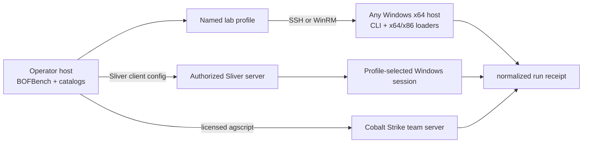
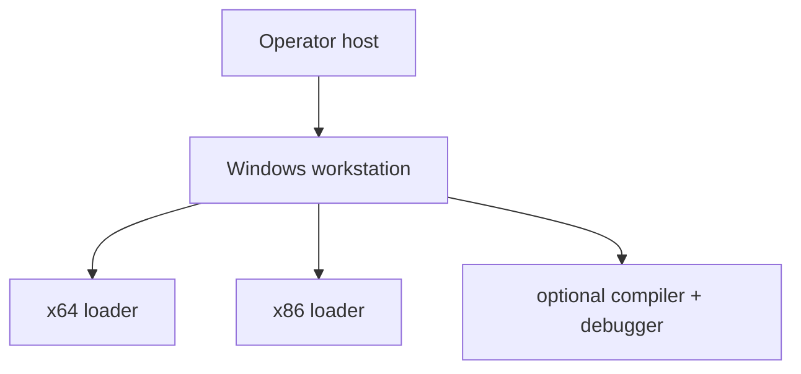
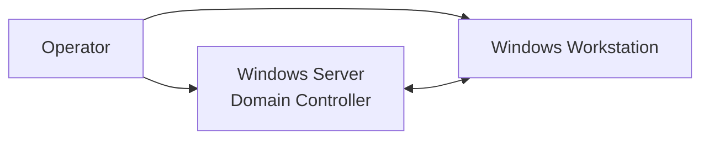

# Lab Architecture and Setup

The lab keeps project content, machine connection details, and runtime sessions separate while preserving one build/analyze/run workflow.



## Prepare a fresh Windows host

The initial requirement is only an operator-controlled SSH or WinRM connection. Print the one-time elevated PowerShell for the selected transport:

```bash
bofbench lab setup-script --transport ssh
bofbench lab setup-script --transport winrm
```

Run the printed block in an elevated PowerShell window on Windows, then register the host:

```bash
bofbench lab add fresh \
  --provider existing \
  --transport ssh \
  --host fresh-windows \
  --user operator \
  --remote-root 'C:\bofbench'

bofbench lab bootstrap --lab fresh
bofbench lab status --lab fresh
```

No Windows password, SSH private-key contents, Sliver secret, or Cobalt Strike password is stored in a project. The global profile stores only connection values and paths to key/known-hosts files.

## What bootstrap provides

Bootstrap is safe to repeat. It uploads the Windows CLI and loader helpers only when hashes differ and probes:

| Capability | Result means |
| --- | --- |
| remote compile | MinGW or MSVC can build the project on Windows. |
| local-build fallback | The operator can build and upload the object when Windows has no compiler. |
| native x64 | AMD64 BOFs can execute through the child loader. |
| native x86 | I386 BOFs can execute through the WoW64 helper. |
| Sliver | the selected client/config/session prerequisites are available. |
| debugging | crash/debug collection tooling is available. |
| snapshots | the provider exposes a recoverable snapshot operation. |

Lab runs default to `--bootstrap auto`. Use `--bootstrap never` for a target that must not receive runtime updates.

## Build location

Set `--build-mode auto`, `remote`, or `local` when adding or cloning a profile:

```bash
bofbench lab add compiler-free --from fresh --build-mode local
bofbench run bofs/portable-survey --via lab --lab compiler-free \
  --arg process_filter=lsass --arg result_limit=5
```

`auto` prefers a supported compiler on Windows and otherwise builds locally. `remote` requires MinGW or MSVC on Windows. `local` always builds on the operator host and uploads the object.

## SSH and WinRM

Existing machines may use either transport. SSH keeps host-key verification enabled and supports aliases or direct host/user/port/identity fields. Existing-machine WinRM reads its password from a profile-specific environment variable or a no-echo prompt.

```bash
bofbench lab add clean-winrm \
  --provider existing \
  --transport winrm \
  --host 10.0.0.60 \
  --user operator

export BOFBENCH_LAB_CLEAN_WINRM_WINRM_PASSWORD='...'
bofbench lab status --lab clean-winrm
```

See [Portable Lab Profiles](lab-profiles.md) for the full configuration model and selection precedence.

## Proxmox-native disposable labs

Use a Proxmox profile when BOFBench should own clone, power, snapshot, restore, and teardown for an isolated Windows VM. BOFBench scopes those actions to the configured pool and VMID range; existing machines and resources outside that pool are never lifecycle-controlled.

```bash
bofbench lab add win11-clean \
  --provider proxmox \
  --proxmox-prep ~/.config/bofbench/proxmox-lab.json \
  --proxmox-vmid 4110 \
  --proxmox-template-vmid 4100 \
  --transport ssh --user Administrator \
  --identity ~/.ssh/bofbench-windows \
  --build-mode local

bofbench lab up --lab win11-clean
bofbench lab bootstrap --lab win11-clean
```

The clean template needs no compiler in local-build mode. A development template may include MSVC, MinGW x64/x86, Go, and WinDbg and use remote-build mode. The checked-in `infra/proxmox` assets define the isolated bridge services, answer-file builder, Windows provisioner, and development-tool installer. See [Proxmox-Native Labs](proxmox-labs.md).

## Standalone Vagrant topology



```bash
bofbench lab add disposable \
  --provider vagrant \
  --vagrantfile lab/Vagrantfile \
  --machine workstation \
  --topology standalone
bofbench lab up --lab disposable
bofbench lab snapshot clean --lab disposable
```

BOFBench invokes the operator-supplied Vagrantfile and licensed Windows box. Vagrant provides the current WinRM connection dynamically.

## Domain topology



Use `--topology domain` with an operator-supplied Server/workstation Vagrant environment. Domain and lateral-movement packs target only hosts explicitly passed by the operator; BOFBench does not autonomously propagate or scan address ranges.

## Repeatable operating loop

```bash
bofbench lab restore clean --lab disposable
bofbench run bofs/portable-survey --via lab --lab disposable \
  --arg process_filter=lsass --arg result_limit=5
bofbench analyze bofs/portable-survey
bofbench lab snapshot after-survey --lab disposable
```
