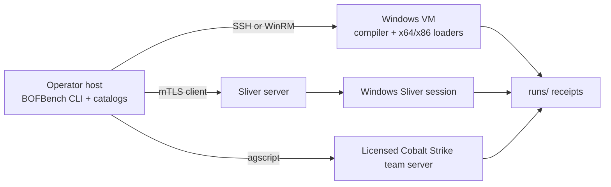
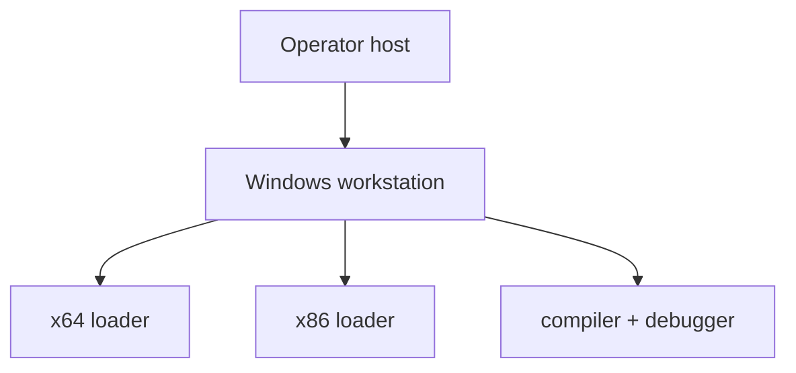
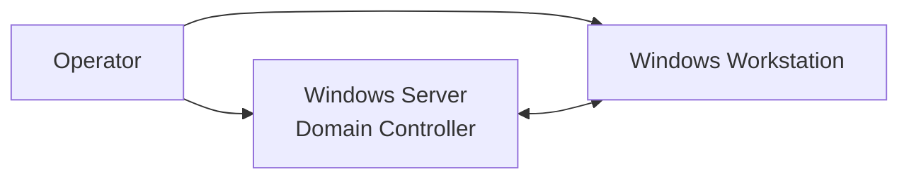

# Lab Architecture and Setup

The lab keeps the operator CLI, Windows execution host, and optional C2 runtime separate while preserving one project and one argument contract.



## Existing VM checklist

The VM needs Windows x64, an operator-controlled transport, and enough disk for the remote workspace. Compilers and C2 tooling are optional and reported separately.

```bash
bofbench lab init \
  --provider existing \
  --host bofbench-winvm
bofbench lab bootstrap
bofbench lab status
```

No Windows password, SSH private key, Sliver secret, or Cobalt Strike password is stored in `.bofbench/lab.json`.

Bootstrap deploys the Windows CLI and both loader helpers, creates the remote workspace, and probes:

| Capability | Result means |
| --- | --- |
| compile | MinGW or MSVC can build a project. |
| native x64 | AMD64 BOFs can execute through the child loader. |
| native x86 | I386 BOFs can execute through the WoW64 helper. |
| Sliver | the requested Sliver prerequisites are usable. |
| debugging | crash/debug collection tooling is available. |
| snapshots | the provider exposes restore points. |

## Transport

The existing provider defaults to SSH because Windows OpenSSH works consistently from macOS/Linux operator hosts. Provider-backed environments may use WinRM. Override the saved host, remote root, or executable through lab configuration or the corresponding command flags.

## Standalone topology



```bash
bofbench lab init --provider vagrant --topology standalone
bofbench lab up
bofbench lab snapshot clean
```

BOFBench invokes the operator-supplied Vagrantfile and licensed Windows box. It does not download or embed a Windows image.

## Domain topology



Use `--topology domain` with an operator-supplied Server/workstation Vagrant environment. Domain and lateral-movement packs target only hosts passed by the operator; there is no autonomous propagation or unconstrained scanning.

## Daily loop

```bash
bofbench lab restore clean
bofbench run bofs/fieldcheck --via lab \
  --arg process_filter=lsass --arg result_limit=25
bofbench analyze bofs/fieldcheck
bofbench lab snapshot after-fieldcheck
```

Use a clean snapshot for repeatable state-changing tests. Cleanup companions remove their exact named artifact, but snapshot restore remains the strongest whole-machine reset.
