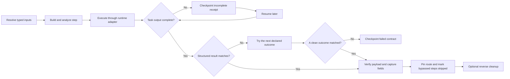

# Composable, Provable Multi-Step Operations

Operations connect capability packs into a result-aware, forward-only workflow. A step can capture a structured output field—such as a PID, address, hash, path, object name, or pipe name—and pass it to a later step. Version 3 can route a completed, understood result to a later step. Version 4 can invoke another catalog operation as an atomic child step. The operation advances only when both conditions are true:

1. the runtime task completed with complete output; and
2. the step's declared structured-result contract matched.

A loader invocation that exits normally but emits a declared clean-failure result can select an explicit fallback. A runtime crash, timeout, or incomplete result cannot select a fallback because its effects are unknown. Packs remain independently buildable and runnable; operations add sequencing, result contracts, ordered outcomes, captures, checkpointing, static testing, live proof, resume, and reverse cleanup.

<video controls preload="metadata" poster="assets/images/operation-lifecycle.png" width="100%">
  <source src="assets/media/operation-lifecycle.webm" type="video/webm">
</video>

## Discover, test, and prove

```bash
bofbench operation list
bofbench operation search memory
bofbench operation show internal/virtual-memory-execute
bofbench operation graph internal/coordination-matrix
bofbench operation graph internal/coordination-matrix --expand
bofbench operation graph internal/coordination-matrix --expand --format mermaid
bofbench operation graph internal/coordination-matrix --expand --format json
bofbench operation validate operations/example/operation.json

# Portable build, analyzer, and export coverage
bofbench operation test internal/virtual-memory-execute
bofbench operation test --all --catalog ~/bofbench-packs-internal \
  --compiler mingw --compiler msvc

# Declared fixtures, contracts, state checks, and reverse cleanup
bofbench operation prove internal/virtual-memory-execute \
  --catalog ~/bofbench-packs-internal \
  --via lab --lab devbox --arch x64
```

`operation test` validates the definition, builds every unique action and cleanup pack for every declared architecture, checks analyzer expectations, and verifies raw, Sliver, and Cobalt Strike exports. An unavailable compiler is recorded as unavailable coverage.

`operation prove` resolves the operation's declared proof cases. It deploys the disposable target when needed, evaluates each step contract, verifies captures and independent host state, performs requested cleanup in reverse order, and writes `runs/<run-id>/operation-proof.json`.

## Run with operator inputs

```bash
bofbench operation run internal/virtual-memory-execute \
  --via lab --lab devbox --arch x64 \
  --arg target_pid=1234 \
  --arg payload=@file:/absolute/path/payload.bin \
  --arg payload_size=256 \
  --arg payload_sha256=<sha256> \
  --arg wait_ms=5000
```

Normal operation accepts operator-selected targets and payloads. Proof fixtures and benign proof payloads are acceptance infrastructure, not runtime restrictions. `--cleanup` and `--cleanup-on-failure` remain optional.

The run creates `runs/<run-id>/operation.json`. The version-4 receipt pins the complete transitive operation and pack set, action and cleanup pack hashes, child receipt paths, object hashes, runtime receipts, contract state, matched outcomes, parent and expanded execution paths, skipped steps, non-sensitive captures, and nested cleanup results. Sensitive values are never stored.



## Result contracts

Operation schema version 2 adds `steps[].expect`. A contract selects one structured output tag and matches fields using:

| Value | Meaning |
|---|---|
| `"complete"` | exact literal match |
| `"*"` | field must exist and be non-empty |
| `"$input.payload_size"` | match a resolved operation input |
| `"$capture.remote_base"` | match an earlier capture |
| `"$topology.target.computer_name"` | match a topology value |

Payload contracts can join bounded hex or base64 chunks in memory and compare their SHA-256 before sensitive output is redacted. The receipt records `payload_verified=true`; it does not store the recovered sensitive bytes.

```json
{
  "id": "allocate",
  "pack": "process-memory-allocate",
  "arguments": {
    "target_pid": "$input.target_pid",
    "size": "$input.payload_size",
    "protection": "4"
  },
  "expect": {
    "tag": "process-memory-allocate",
    "fields": {
      "status": "complete",
      "bytes": "$input.payload_size",
      "remote_base": "*"
    }
  },
  "captures": {
    "remote_base": {
      "tag": "process-memory-allocate",
      "field": "remote_base"
    }
  }
}
```

Schema-version-1 operations remain readable and executable. Their steps are labeled `legacy` because they have no result contract. Schema-version-2 operations retain their linear result contracts unchanged.

## Nested operations

Schema version 4 lets a step select exactly one `pack` or `operation`. A child receives explicitly mapped inputs and inherits the parent's runtime, architecture, compiler, lab, and topology. Only declared non-sensitive captures can be exported back to the parent.

```json
{
  "id": "mutex",
  "operation": "named-mutex-lifecycle",
  "arguments": {
    "holder_pid": "$input.holder_pid",
    "mutex_name": "$input.mutex_name"
  },
  "expect": {
    "tag": "operation",
    "fields": {"status": "complete", "operation": "*"}
  },
  "captures": {
    "mutex_handle": {"capture": "mutex_handle"}
  }
}
```

Nested behavior is deterministic:

- a child contract or runtime failure fails the parent step;
- an incomplete C2 child remains incomplete and resume delegates to its child receipt;
- a child cannot silently select a parent fallback after a runtime failure;
- cleanup visits completed parent steps in reverse order and recursively cleans completed child steps in reverse order;
- the registry rejects direct and indirect operation-call cycles;
- definition pinning covers every transitive child operation, action pack, and cleanup pack.

Collapsed graphs show one node per child. Expanded graphs use slash-qualified breadcrumbs:

```bash
bofbench operation show internal/coordination-matrix --expand
bofbench operation graph internal/coordination-matrix --expand
```

```text
mutex -> semaphore
mutex -> mutex/create [contains]
mutex/create -> mutex/query_before
mutex/query_before -> mutex/acquire_release
mutex/acquire_release -> mutex/query_after
```

The receipt retains both `actual_path` (`mutex → semaphore → …`) and `expanded_path` (`mutex/create → mutex/query_before → …`). Each child step records its receipt path and nested cleanup state.

## Ordered outcomes and result routing

Schema version 3 lets a step replace `expect` with ordered `outcomes`. The first matching structured result pins the next step. Targets may be only a later step, `$complete`, or `$fail`; backward edges and cycles are rejected.

```json
{
  "id": "map",
  "pack": "process-section-map",
  "outcomes": [
    {
      "id": "mapped",
      "expect": {
        "tag": "process-section-map",
        "fields": {"status": "complete", "remote_base": "*"}
      },
      "next": "section-start"
    },
    {
      "id": "fallback",
      "expect": {
        "tag": "process-section-map",
        "fields": {"status": "failed"}
      },
      "next": "allocate"
    }
  ]
}
```

Order matters when outcome contracts overlap. BOFBench records the matched outcome and next step before advancing. Resume uses that recorded route and never reevaluates an earlier branch against changed output. Every unvisited definition step is recorded as `skipped`, and cleanup walks only completed stateful steps in reverse execution order.

Use `operation graph` before execution to inspect the route:

```text
map · process-section-map
  mapped   -> section-start
  fallback -> allocate
section-start -> complete
allocate -> write -> protect -> fallback-start -> complete
```

`--format mermaid` produces a documentation-ready flowchart. `--format json` produces stable nodes and edges for other tooling.

## Reference and capture forms

| Form | Meaning |
|---|---|
| `$input.target_pid` | typed operator input |
| `$capture.remote_base` | named capture from an earlier step |
| `$step.map.remote_base` | the same capture with its producing step explicit |
| `$topology.target.computer_name` | resolved topology role value |

Forward references are rejected. Captures are extracted only after the step contract matches. A capture declared sensitive by its pack cannot be persisted for later steps.

## Proof cases and independent state

Version 4 proof cases retain architectures, runtimes, topology roles, typed proof inputs, expected captures, independent state checks, and cleanup selection. `expect_path` proves the parent route and `expect_expanded_path` proves child breadcrumbs. Pack proof placeholders include `$TARGET_PID`, `$TARGET_TID`, `$TARGET_HOLDER_PID`, `$TARGET_JOB_MEMBER_PID`, `$TARGET_EVENT_NAME`, `$TARGET_SECTION_NAME`, `$TARGET_MUTEX_NAME`, `$TARGET_SEMAPHORE_NAME`, `$TARGET_TIMER_NAME`, `$TARGET_MAILSLOT_NAME`, `$TARGET_NAMED_PIPE`, `$PAYLOAD_RET_PATH`, `$PROOF_SECRET_PATH`, and `$RUN_ID`. State checks may consume dynamic values such as `$capture.remote_base` or `$capture.retained_handle`.

```json
{
  "id": "allocation-roundtrip",
  "via": ["lab", "sliver"],
  "architectures": ["x64", "x86"],
  "inputs": {
    "target_pid": "$TARGET_PID",
    "payload": "$PROOF_SECRET_PATH",
    "payload_size": "18",
    "payload_sha256": "$PROOF_SECRET_SHA256"
  },
  "expect_captures": {"remote_base": "*"},
  "expect_path": ["allocate", "write", "read"],
  "cleanup": true,
  "state_checks": [
    {
      "phase": "after_cleanup",
      "kind": "process_memory_region",
      "expect": "absent",
      "parameters": {
        "pid": "$TARGET_PID",
        "address": "$capture.remote_base"
      }
    }
  ]
}
```

Proof reports use `bofbench.operation-proof` version 1 and distinguish `pass`, `failed`, `incomplete`, and `unavailable`. A missing Sliver session or Cobalt Strike client is explicit unavailable coverage; it is never represented as live success.

## Incomplete tasks and resume

Submitted or running C2 tasks leave the step and operation `incomplete`:

```bash
bofbench operation resume runs/<run-id>/operation.json
```

Resume refreshes the embedded runtime receipt—or recursively resumes an incomplete child receipt—confirms the pinned transitive hashes, evaluates the step contract or ordered outcomes, and only then extracts captures and advances. A persisted route is never recalculated, completed steps are retained, and unvisited steps remain skipped. Failed runtime work is terminal rather than an implicit retry. Resupply sensitive inputs when an unfinished step still needs them:

```bash
bofbench operation resume runs/<run-id>/operation.json \
  --arg password=@prompt
```

Resume refuses changed operation or pack definitions because persisted captures belong to the pinned code.

## Cleanup

Cleanup executes completed stateful steps in reverse order:

```bash
bofbench operation cleanup runs/<run-id>/operation.json
```

Repeated cleanup skips completed cleanup work. A failed step still prints and stores its receipt path, so the operator can inspect contract and runtime state before deciding whether to retry or clean completed work.

## Runtime and topology selection

All steps share `--via`, `--lab`, `--topology`, `--arch`, and `--compiler`. This keeps addresses and captures inside one runtime context.

```bash
bofbench operation prove internal/remote-service-lifecycle \
  --catalog ~/bofbench-packs-internal \
  --via lab --topology dedicated-standalone --arch x64
```

Topologies contain profile names only. Authentication values continue to use `@prompt`, `@env:NAME`, or `@file:/path`.

## TUI

Open `bofbench tui` and select **Operations**. Choose a definition, runtime, lab, architecture, and typed inputs. Press `x` for static test or `p` for declared proof; execute ordinary runs with `enter`. The definition view shows available routes. The result view separates runtime task state from contract state and shows the actual path, matched outcomes, skipped steps, captures, resume, and cleanup commands.

## Common failures

- **Runtime complete, contract failed:** inspect `contract_state`, `matched_tag`, and the structured output. The BOF ran, but its declared result was not successful.
- **No outcome matched:** the runtime result was complete, but no declared clean result described it. The operation stops instead of guessing a route.
- **Runtime failed before routing:** inspect the runtime receipt. Crashes, timeouts, and incomplete output never select a fallback because effects may be unknown.
- **Missing tag or field:** the pack output no longer matches the operation definition; update the operation only after confirming the pack contract.
- **Payload hash mismatch:** verify the declared encoding, bounded response size, and expected SHA-256.
- **Missing capture:** captures occur after contract matching; fix the producing step rather than supplying a guessed value.
- **Incomplete output:** follow the C2 task, then resume the operation receipt.
- **Changed definition:** start a new operation so code and captures remain correlated.
- **Unavailable runtime:** use `bofbench runtime status --lab <name>` and select an available adapter.
- **Cleanup input was sensitive:** resupply it with `operation cleanup --arg name=@prompt`.

See the [generated operation reference](operation-reference.md), [testing and proof guidance](pack-testing.md), and [operation lifecycle scenario](scenarios/operation-lifecycle.md).
