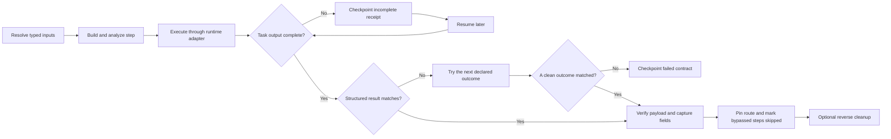
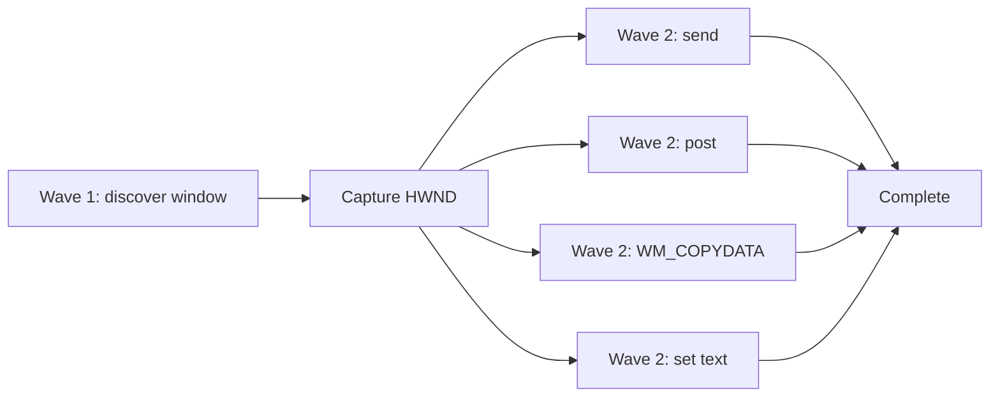
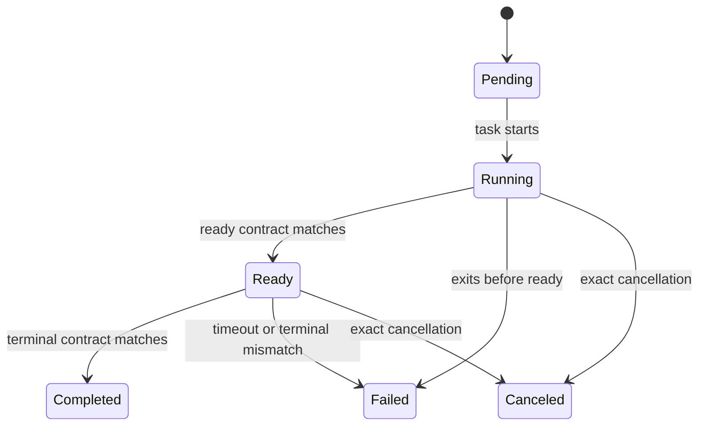
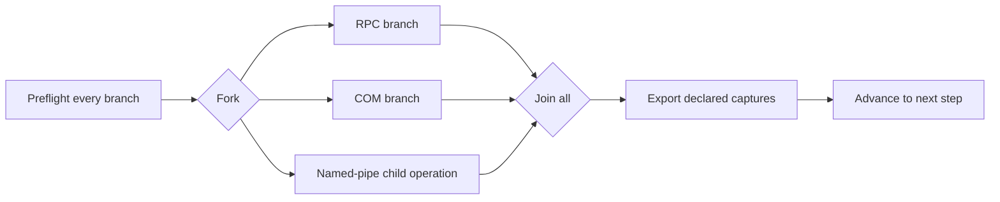

# Composable, Provable Multi-Step Operations

Operations connect capability packs into result-aware workflows. A step can capture a structured output field—such as a PID, address, hash, path, object name, pipe name, window handle, or retained handle—and pass it to later work. Version 3 can route a completed, understood result to a later step. Version 4 can invoke another catalog operation as an atomic child step. Version 5 can run explicit parallel groups. Version 6 adds dependency-aware DAG execution. Version 7 adds bounded background steps, readiness dependencies, live progress, and cancellation. Version 8 adds finite retry for explicitly declared complete transient results. Version 9 adds safe interpolation of typed inputs, topology fields, and ancestor captures inside argument strings. Version 10 adds finite, operator-controlled fan-out over an exact typed input. Work advances only when the relevant contract is true:

1. the runtime task completed with complete output; and
2. the step's declared structured-result contract matched.

A loader invocation that exits normally but emits a declared clean-failure result can select an explicit fallback. A runtime crash, timeout, or incomplete result cannot select a fallback because its effects are unknown. Packs remain independently buildable and runnable; operations add sequencing, result contracts, ordered outcomes, parallel groups, captures, checkpointing, static testing, live proof, resume, and reverse cleanup.

<video controls preload="metadata" poster="assets/images/operation-lifecycle.png" width="100%">
  <source src="assets/media/operation-lifecycle.webm" type="video/webm">
</video>

## Discover, test, and prove

```bash
bofbench operation list
bofbench operation search memory
bofbench operation show internal/virtual-memory-execute
bofbench operation graph internal/coordination-matrix
bofbench operation graph internal/coordination-matrix --expand
bofbench operation graph internal/coordination-matrix --expand --format mermaid
bofbench operation graph internal/coordination-matrix --expand --format json
bofbench operation validate operations/example/operation.json

# Portable build, analyzer, and export coverage
bofbench operation test internal/virtual-memory-execute
bofbench operation test --all --catalog ~/bofbench-packs-internal \
  --compiler mingw --compiler msvc

# Declared fixtures, contracts, state checks, and reverse cleanup
bofbench operation prove internal/virtual-memory-execute \
  --catalog ~/bofbench-packs-internal \
  --via lab --lab devbox --arch x64 --parallelism 4
```

`operation test` validates the definition, builds every unique action and cleanup pack for every declared architecture, checks analyzer expectations, and verifies raw, Sliver, and Cobalt Strike exports. An unavailable compiler is recorded as unavailable coverage.

`operation prove` resolves the operation's declared proof cases. It deploys the disposable target when needed, evaluates each step contract, verifies captures and independent host state, performs requested cleanup in reverse order, and writes `runs/<run-id>/operation-proof.json`.

## Run with operator inputs

```bash
bofbench operation run internal/virtual-memory-execute \
  --via lab --lab devbox --arch x64 --parallelism 4 \
  --arg target_pid=1234 \
  --arg payload=@file:/absolute/path/payload.bin \
  --arg payload_size=256 \
  --arg payload_sha256=<sha256> \
  --arg wait_ms=5000
```

Normal operation accepts operator-selected targets and payloads. Proof fixtures and benign proof payloads are acceptance infrastructure, not runtime restrictions. `--cleanup` and `--cleanup-on-failure` remain optional.

The run creates `runs/<run-id>/operation.json`. The version-9 receipt pins the complete transitive operation and pack set, action and cleanup pack hashes, child receipt paths, object hashes, runtime receipts, terminal and readiness contract state, matched outcomes, completion/readiness dependencies, waves, blocked steps, active task identity, timestamps, cancellation state, parent and expanded execution paths, non-sensitive captures, retry attempts/reasons/backoff, resolved template arguments, and cleanup results. Sensitive values are never stored.



## Dependency-aware DAG operations

Schema version 6 lets steps declare dependencies instead of relying on declaration order:

```json
{
  "schema": "bofbench.operation",
  "schema_version": 6,
  "execution": "dag",
  "id": "window-message-matrix",
  "steps": [
    {
      "id": "discover",
      "pack": "window-inventory",
      "depends_on": [],
      "expect": {
        "tag": "window-inventory",
        "fields": {"status": "complete", "window_handle": "*"}
      },
      "captures": {
        "window_handle": {"tag": "window-inventory", "field": "window_handle"}
      }
    },
    {
      "id": "send",
      "pack": "window-message-send",
      "depends_on": ["discover"],
      "arguments": {"window_handle": "$capture.window_handle"},
      "expect": {
        "tag": "window-message-send",
        "fields": {"status": "complete"}
      }
    }
  ]
}
```

BOFBench validates the graph before building anything:

- cycles are rejected;
- a capture may be consumed only by a transitive descendant;
- every DAG step has one explicit result contract;
- ordered outcomes and direct parallel groups stay in linear definitions rather than being mixed into a DAG;
- child operations remain valid DAG nodes and retain their own nested receipts.

Execution proceeds in ready waves. Every step in a wave is resolved, built, analyzed, argument-packed, and runtime-prepared before any member executes. Ready steps then run under the global `--parallelism 1–16` limit.



The first failed or incomplete step stops new scheduling. Independent work that already started is allowed to finish and is recorded. Descendants that cannot run become `blocked`; unrelated unscheduled roots remain pending for resume. Resume refreshes incomplete C2 receipts first, skips completed steps, and continues at the next ready wave. Cleanup walks completed stateful work in reverse topological order and uses reverse declaration order to break ties.

Inspect a DAG before running it:

```bash
bofbench operation graph internal/ipc-dependency-matrix --expand
bofbench operation run internal/ipc-dependency-matrix \
  --via lab --lab devbox --parallelism 4
```

Proof definitions can assert both `expect_waves` and `expect_steps`, so scheduling shape is part of repeatable acceptance rather than an informal terminal observation.

## Background readiness and asynchronous control

Schema version 7 permits a direct pack step in a DAG to remain active after emitting a declared readiness result:

```json
{
  "schema": "bofbench.operation",
  "schema_version": 7,
  "execution": "dag",
  "id": "registry-change-observe",
  "steps": [
    {
      "id": "watch",
      "pack": "registry-change-wait",
      "mode": "background",
      "ready": {
        "tag": "registry-change-wait",
        "fields": {"status": "ready"}
      },
      "expect": {
        "tag": "registry-change-wait",
        "fields": {"status": "complete"}
      },
      "timeout_ms": 120000
    },
    {
      "id": "trigger",
      "pack": "remote-registry-write",
      "depends_on_ready": ["watch"],
      "expect": {
        "tag": "remote-registry-write",
        "fields": {"status": "*"}
      }
    }
  ]
}
```

The lifecycle is explicit:



Rules:

- background steps exist only in version-7 DAGs;
- each background step declares `ready`, terminal `expect`, and a bounded `timeout_ms`;
- `depends_on` waits for terminal completion;
- `depends_on_ready` waits only for the readiness contract;
- ready captures may flow only to transitive descendants;
- runtime failure or incomplete output never selects a fallback;
- cleanup visits completed stateful work in reverse topological order.

Monitor and control live work directly:

```bash
bofbench operation watch runs/<run-id>/operation.json --follow
bofbench runtime tasks --via lab
bofbench runtime task <task-id> --refresh
bofbench operation cancel runs/<run-id>/operation.json
bofbench operation cancel runs/<run-id>/operation.json --cleanup
```

Native and lab execution use isolated task workers and atomically written receipts. Lab background work runs beneath a run-specific Windows scheduled-task controller so cancellation can terminate the recorded worker and every descendant loader process instead of merely closing the transport. Cancellation stops new scheduling first, cancels every active exact task, waits for terminal receipts, and only then performs requested cleanup. Sliver and Cobalt Strike cancellation is reported only when the detected runtime provides an exact supported mechanism.

Pack schema version 5 can delegate a pack's live proof to an operation step. The proof passes only when the operation used the exact resolved pack hash and the selected action or cleanup phase completed successfully.

## Explicit bounded retry

Schema version 8 allows a direct pack step in a DAG to retry only a complete result that matches a named `when` contract:

```json
{
  "id": "request",
  "pack": "winhttp-request",
  "expect": {
    "tag": "winhttp-request",
    "fields": {"status": "complete", "http_status": "200"}
  },
  "retry": {
    "max_attempts": 3,
    "delay_ms": 500,
    "backoff": "exponential",
    "max_delay_ms": 4000,
    "when": [
      {
        "id": "transient-http",
        "expect": {
          "tag": "winhttp-request",
          "fields": {"status": "complete", "http_status": "503"}
        }
      }
    ]
  }
}
```

The boundary is deliberate:

- `max_attempts` is 2–16 and counts the first attempt;
- backoff is deterministic `fixed` or `exponential`, with no jitter;
- a runtime crash, timeout, partial output, incomplete C2 task, or undeclared result is not retried;
- a background step may retry only before it reaches readiness;
- cancellation interrupts pending backoff;
- resume refreshes the current attempt and preserves the attempt budget;
- each attempt retains its exact runtime receipt, matched reason, captures, delay, and optional cleanup result.

Proof cases can assert `expect_attempts` and the ordered `expect_retry_reasons`. Watch, graph, JSON, and the TUI expose `attempt N/max`, the current reason, next eligible time, and exhaustion. See [Resilient Network Transport](scenarios/network-transport-retry.md) for a 503→200 run that uses no wrapper scripts.

## Runtime argument templates

Schema version 9 can place resolved values inside an otherwise literal argument:

```json
{
  "id": "request",
  "pack": "winhttp-request",
  "depends_on_ready": ["listener"],
  "arguments": {
    "url": "http://${input.bind_address}:${capture.port}/echo"
  }
}
```

Supported forms are `${input.name}`, `${capture.name}`, `${step.id.capture}`, and `${topology.role.field}`. Existing exact references such as `$input.url` remain unchanged. Templates are resolved by BOFBench itself; they do not run a shell, evaluate expressions, expand environment variables, or create steps dynamically.

Validation applies the same rules as exact references:

- every input must exist;
- every capture must already exist in a linear definition or belong to a transitive DAG ancestor;
- topology references must select a declared role and field;
- missing and unterminated references stop before build or execution;
- an argument containing a sensitive input remains sensitive after interpolation and is redacted from receipts.

Version-1 through version-8 definitions remain readable, but embedded templates require version 9. The TUI definition view lists every templated argument before execution.

## Bounded fan-out

Schema version 10 can expand one terminal linear step, or one DAG child-operation step, from a declared input containing exact paths or targets:

```json
{
  "id": "multi-path-file-collection",
  "schema": "bofbench.operation",
  "schema_version": 10,
  "inputs": [
    {"name": "paths", "type": "string", "required": true}
  ],
  "steps": [
    {
      "id": "collect",
      "pack": "file-collect",
      "fan_out": {
        "source": "$input.paths",
        "separator": ";",
        "max_items": 16
      },
      "arguments": {"path": "$item"},
      "expect": {"tag": "file-collect", "fields": {"status": "complete"}}
    }
  ]
}
```

Fan-out is explicit and finite:

- the source is one declared, non-sensitive exact input;
- separators are comma, semicolon, or newline;
- empty items are removed and duplicate items retain first-seen order;
- `max_items` is 1–64 and is checked before build or execution;
- `$item` and `${item}` are resolved by BOFBench, never by a shell;
- each expanded branch is pinned with its definition, pack/object hashes, runtime receipt, result contract, captures, and cleanup state;
- `--parallelism 1–16` bounds execution across the expansion;
- cleanup visits only completed stateful branches in reverse execution order.

The receipt records source, separator, declared maximum, resolved count, completed/failed/incomplete counts, maximum concurrency, and each branch's non-sensitive item and terminal state. Proof cases can assert `expect_fan_out`. Fan-out does not scan, discover, or synthesize targets; it operates only on values the operator supplied.

```bash
bofbench operation show internal/multi-target-remote-triage --expand
bofbench operation run internal/multi-target-remote-triage \
  --via lab --topology dedicated-standalone --parallelism 4 \
  --arg targets='host-a;host-b'
```

## Parallel groups

Schema version 5 lets one step contain a `parallel` group instead of a `pack` or child `operation`. Each branch selects exactly one pack or operation. The current join policy is `all`: every branch must reach a complete, contract-matched result before the parent advances.

```json
{
  "id": "probe",
  "parallel": {
    "join": "all",
    "branches": [
      {
        "id": "rpc",
        "pack": "rpc-binding-probe",
        "arguments": {
          "string_binding": "$input.string_binding",
          "timeout_ms": "$input.timeout_ms"
        },
        "expect": {
          "tag": "rpc-binding-probe",
          "fields": {"status": "complete", "rpc_status": "*"}
        }
      },
      {
        "id": "com",
        "pack": "com-dispatch-invoke",
        "arguments": {
          "class_kind": "progid",
          "class_name": "Scripting.Dictionary",
          "member": "Count",
          "invoke_kind": "get"
        },
        "expect": {
          "tag": "com-dispatch-invoke",
          "fields": {"status": "complete", "result_type": "*"}
        }
      }
    ]
  }
}
```

Before the first branch is launched, BOFBench resolves every branch definition, builds and analyzes every direct pack, packs typed arguments, detects the runtime, and prepares the runtime adapter. A preparation failure therefore stops the group before any branch effect occurs.

At execution time:

- `--parallelism <1-16>` bounds concurrent pack work across the full nested operation; the default is `4`;
- declaration order controls terminal rendering, receipt order, exported captures, and reverse cleanup order even when completion order differs;
- a runtime failure fails the group; an incomplete branch makes the group resumable; incomplete wins over failure until every branch is terminal;
- submitted or running C2 work cannot satisfy the join;
- resume enters incomplete child receipts and branches without rerunning completed work;
- cleanup visits completed branches in reverse declaration order and recursively cleans child operations;
- exports must explicitly name a non-sensitive branch capture, for example `$branch.named_pipe.server_handle`.



Inspect the selected limit and actual concurrency in the receipt:

```text
parallelism: 4
max_concurrency: 3
steps[].parallel.state: completed
steps[].parallel.observed_concurrency: 3
steps[].parallel.branches[].state: completed
```

Use `--parallelism 1` to serialize branches while preserving the same contracts, graph, receipt shape, and cleanup behavior.

## Result contracts

Operation schema version 2 adds `steps[].expect`. A contract selects one structured output tag and matches fields using:

| Value | Meaning |
|---|---|
| `"complete"` | exact literal match |
| `"*"` | field must exist and be non-empty |
| `"$input.payload_size"` | match a resolved operation input |
| `"$capture.remote_base"` | match an earlier capture |
| `"$topology.target.computer_name"` | match a topology value |

Payload contracts can join bounded hex or base64 chunks in memory and compare their SHA-256 before sensitive output is redacted. The receipt records `payload_verified=true`; it does not store the recovered sensitive bytes.

```json
{
  "id": "allocate",
  "pack": "process-memory-allocate",
  "arguments": {
    "target_pid": "$input.target_pid",
    "size": "$input.payload_size",
    "protection": "4"
  },
  "expect": {
    "tag": "process-memory-allocate",
    "fields": {
      "status": "complete",
      "bytes": "$input.payload_size",
      "remote_base": "*"
    }
  },
  "captures": {
    "remote_base": {
      "tag": "process-memory-allocate",
      "field": "remote_base"
    }
  }
}
```

Schema-version-1 operations remain readable and executable. Their steps are labeled `legacy` because they have no result contract. Schema-version-2 operations retain their linear result contracts unchanged.

## Nested operations

Schema version 4 lets a non-parallel step select exactly one `pack` or `operation`. A child receives explicitly mapped inputs and inherits the parent's runtime, architecture, compiler, lab, and topology. Version 5 retains that behavior inside parallel branches. Only declared non-sensitive captures can be exported back to the parent.

```json
{
  "id": "mutex",
  "operation": "named-mutex-lifecycle",
  "arguments": {
    "holder_pid": "$input.holder_pid",
    "mutex_name": "$input.mutex_name"
  },
  "expect": {
    "tag": "operation",
    "fields": {"status": "complete", "operation": "*"}
  },
  "captures": {
    "mutex_handle": {"capture": "mutex_handle"}
  }
}
```

Nested behavior is deterministic:

- a child contract or runtime failure fails the parent step;
- an incomplete C2 child remains incomplete and resume delegates to its child receipt;
- a child cannot silently select a parent fallback after a runtime failure;
- cleanup visits completed parent steps in reverse order and recursively cleans completed child steps in reverse order;
- the registry rejects direct and indirect operation-call cycles;
- definition pinning covers every transitive child operation, action pack, and cleanup pack.

Collapsed graphs show one node per child. Expanded graphs use slash-qualified breadcrumbs:

```bash
bofbench operation show internal/coordination-matrix --expand
bofbench operation graph internal/coordination-matrix --expand
```

```text
mutex -> semaphore
mutex -> mutex/create [contains]
mutex/create -> mutex/query_before
mutex/query_before -> mutex/acquire_release
mutex/acquire_release -> mutex/query_after
```

The receipt retains both `actual_path` (`mutex → semaphore → …`) and `expanded_path` (`mutex/create → mutex/query_before → …`). Each child step records its receipt path and nested cleanup state.

## Ordered outcomes and result routing

Schema version 3 lets a step replace `expect` with ordered `outcomes`. The first matching structured result pins the next step. Targets may be only a later step, `$complete`, or `$fail`; backward edges and cycles are rejected.

```json
{
  "id": "map",
  "pack": "process-section-map",
  "outcomes": [
    {
      "id": "mapped",
      "expect": {
        "tag": "process-section-map",
        "fields": {"status": "complete", "remote_base": "*"}
      },
      "next": "section-start"
    },
    {
      "id": "fallback",
      "expect": {
        "tag": "process-section-map",
        "fields": {"status": "failed"}
      },
      "next": "allocate"
    }
  ]
}
```

Order matters when outcome contracts overlap. BOFBench records the matched outcome and next step before advancing. Resume uses that recorded route and never reevaluates an earlier branch against changed output. Every unvisited definition step is recorded as `skipped`, and cleanup walks only completed stateful steps in reverse execution order.

Use `operation graph` before execution to inspect the route:

```text
map · process-section-map
  mapped   -> section-start
  fallback -> allocate
section-start -> complete
allocate -> write -> protect -> fallback-start -> complete
```

`--format mermaid` produces a documentation-ready flowchart. `--format json` produces stable nodes and edges for other tooling.

## Reference and capture forms

| Form | Meaning |
|---|---|
| `$input.target_pid` | typed operator input |
| `$capture.remote_base` | named capture from an earlier step |
| `$step.map.remote_base` | the same capture with its producing step explicit |
| `$topology.target.computer_name` | resolved topology role value |

Forward references are rejected. Captures are extracted only after the step contract matches. A capture declared sensitive by its pack cannot be persisted for later steps.

## Proof cases and independent state

Proof cases retain architectures, runtimes, topology roles, typed proof inputs, expected captures, independent state checks, and cleanup selection. `expect_path` proves the parent route, `expect_expanded_path` proves child and branch breadcrumbs, and schema-v5 `expect_parallel` proves terminal branch state. Pack proof placeholders include `$TARGET_PID`, `$TARGET_TID`, `$TARGET_HOLDER_PID`, `$TARGET_JOB_MEMBER_PID`, `$TARGET_EVENT_NAME`, `$TARGET_SECTION_NAME`, `$TARGET_MUTEX_NAME`, `$TARGET_SEMAPHORE_NAME`, `$TARGET_TIMER_NAME`, `$TARGET_MAILSLOT_NAME`, `$TARGET_NAMED_PIPE`, `$TARGET_NAMED_PIPE_HANDLE`, `$TARGET_NAMED_PIPE_CLIENT_HANDLE`, `$TARGET_PROCESS_PIPE_PID`, `$TARGET_PROCESS_STDIN_HANDLE`, `$TARGET_PROCESS_STDOUT_HANDLE`, `$PAYLOAD_RET_PATH`, `$PROOF_SECRET_PATH`, and `$RUN_ID`. State checks may consume dynamic values such as `$capture.remote_base` or `$capture.retained_handle`.

```json
{
  "id": "allocation-roundtrip",
  "via": ["lab", "sliver"],
  "architectures": ["x64", "x86"],
  "inputs": {
    "target_pid": "$TARGET_PID",
    "payload": "$PROOF_SECRET_PATH",
    "payload_size": "18",
    "payload_sha256": "$PROOF_SECRET_SHA256"
  },
  "expect_captures": {"remote_base": "*"},
  "expect_path": ["allocate", "write", "read"],
  "cleanup": true,
  "state_checks": [
    {
      "phase": "after_cleanup",
      "kind": "process_memory_region",
      "expect": "absent",
      "parameters": {
        "pid": "$TARGET_PID",
        "address": "$capture.remote_base"
      }
    }
  ]
}
```

Proof reports use `bofbench.operation-proof` version 1 and distinguish `pass`, `failed`, `incomplete`, and `unavailable`. A missing Sliver session or Cobalt Strike client is explicit unavailable coverage; it is never represented as live success.

## Incomplete tasks and resume

Submitted or running C2 tasks leave the step and operation `incomplete`:

```bash
bofbench operation resume runs/<run-id>/operation.json
```

Resume refreshes the embedded runtime receipt—or recursively resumes an incomplete child receipt—confirms the pinned transitive hashes, evaluates the step contract or ordered outcomes, and only then extracts captures and advances. A persisted route is never recalculated, completed steps are retained, and unvisited steps remain skipped. Failed runtime work is terminal rather than an implicit retry. Resupply sensitive inputs when an unfinished step still needs them:

```bash
bofbench operation resume runs/<run-id>/operation.json \
  --parallelism 4 --arg password=@prompt
```

Resume refuses changed operation or pack definitions because persisted captures belong to the pinned code.

Submitted, running, or ready native/lab background work is visible through `operation watch`; a ready state is progress, not completion. Resume reevaluates readiness and terminal contracts from the persisted task output before scheduling descendants.

## Cleanup

Cleanup executes completed stateful steps in reverse order:

```bash
bofbench operation cleanup runs/<run-id>/operation.json --parallelism 4
```

Repeated cleanup skips completed cleanup work. A failed step still prints and stores its receipt path, so the operator can inspect contract and runtime state before deciding whether to retry or clean completed work.

## Runtime and topology selection

All steps share `--via`, `--lab`, `--topology`, `--arch`, and `--compiler`. This keeps addresses and captures inside one runtime context.

```bash
bofbench operation prove internal/remote-service-lifecycle \
  --catalog ~/bofbench-packs-internal \
  --via lab --topology dedicated-standalone --arch x64
```

Topologies contain profile names only. Authentication values continue to use `@prompt`, `@env:NAME`, or `@file:/path`.

## TUI

Open `bofbench tui` and select **Operations**. Choose a definition, runtime, lab, architecture, and typed inputs. Press `x` for static test or `p` for declared proof; execute ordinary runs with `enter`. The definition view shows completion dependencies, readiness dependencies, background lifecycles, routes, and child operations. The result view separates runtime, ready, terminal-contract, cancellation, and cleanup state.

## Common failures

- **Runtime complete, contract failed:** inspect `contract_state`, `matched_tag`, and the structured output. The BOF ran, but its declared result was not successful.
- **No outcome matched:** the runtime result was complete, but no declared clean result described it. The operation stops instead of guessing a route.
- **Runtime failed before routing:** inspect the runtime receipt. Crashes, timeouts, and incomplete output never select a fallback because effects may be unknown.
- **Missing tag or field:** the pack output no longer matches the operation definition; update the operation only after confirming the pack contract.
- **Payload hash mismatch:** verify the declared encoding, bounded response size, and expected SHA-256.
- **Missing capture:** captures occur after contract matching; fix the producing step rather than supplying a guessed value.
- **Incomplete output:** follow the C2 task, then resume the operation receipt.
- **Changed definition:** start a new operation so code and captures remain correlated.
- **Unavailable runtime:** use `bofbench runtime status --lab <name>` and select an available adapter.
- **Cleanup input was sensitive:** resupply it with `operation cleanup --arg name=@prompt`.
- **Parallel preparation failed:** no branch was launched. Fix the named build, analysis, argument, or runtime preparation error and start or resume again.
- **Parallel group incomplete:** inspect `steps[].parallel.branches`, finish the named runtime task, then resume the parent receipt.
- **Parallel group failed:** inspect every terminal branch; output remains declaration-ordered even though branches ran concurrently.
- **Background completed before ready:** the runtime ended without matching its readiness contract; inspect the exact watched target and structured output.
- **Ready but terminal timeout:** the dependent action may have run, but the watcher never matched its terminal contract. Inspect both receipts before cleanup.
- **Cancellation unsupported:** the selected runtime does not expose exact task cancellation; BOFBench leaves that state explicit.

See the [generated operation reference](operation-reference.md), [testing and proof guidance](pack-testing.md), and [operation lifecycle scenario](scenarios/operation-lifecycle.md).
