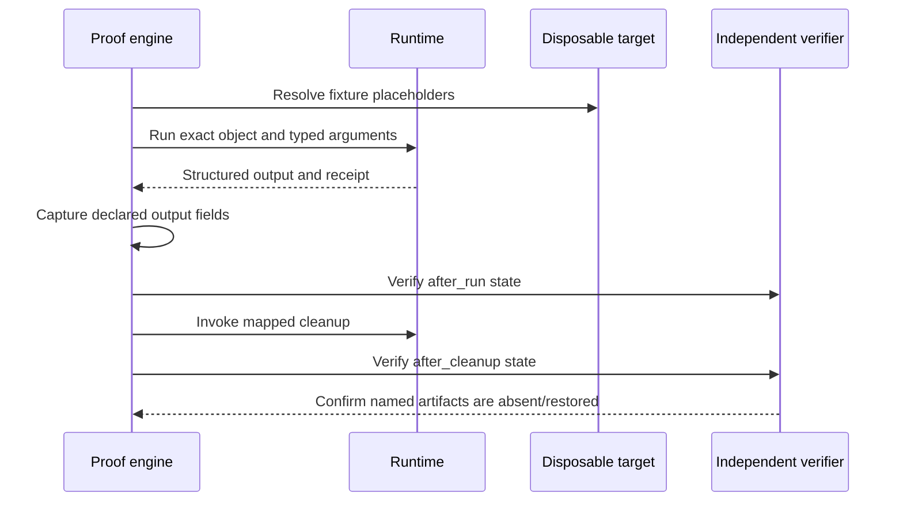

# Test and Prove Capability Packs

Use static pack tests for broad portable coverage and runtime proof for behavior that needs Windows or C2.

## Static contract test

```bash
bofbench pack test process-tree
bofbench pack test --all
bofbench pack test --all --catalog ~/bofbench-packs-internal
```

For every declared architecture, the report records compiler availability, build result, analyzer expectations, and raw/Sliver/Cobalt Strike export verification.

```text
PACK TEST PASS_WITH_UNAVAILABLE
builtin/process-tree  pass_with_unavailable
  build x64  mingw pass
  build x64  msvc  unavailable — MSVC profile requires Windows
  build x86  mingw pass
  export raw          pass
  export sliver       pass
  export cobaltstrike pass
```

`PASS_WITH_UNAVAILABLE` is coverage information, not an approval failure. A compiler or licensed runtime that is not present cannot contribute live coverage.

## Runtime proof

```bash
bofbench lab target deploy --lab devbox
bofbench pack prove process-tree --via lab --lab devbox
bofbench pack prove internal/process-memory-write \
  --catalog ~/bofbench-packs-internal --via lab --lab devbox
bofbench lab target remove --lab devbox
bofbench lab verify clean --lab devbox
```



## Read proof results

Each case is one of:

- `pass`: execution completed, expected output matched, and declared state checks passed.
- `unavailable`: the runtime, role, compiler, or user context was unavailable.
- `failed`: execution, expected output, capture, cleanup, or state verification failed.

Receipts are correlated only when their object hash matches the object built for the case.

## Test and prove multi-step operations

Operation testing reuses the pack build, analyzer, and export machinery for every unique action and cleanup pack in the definition:

```bash
bofbench operation test internal/virtual-memory-execute \
  --catalog ~/bofbench-packs-internal
bofbench operation test --all --catalog ~/bofbench-packs-internal \
  --compiler mingw --compiler msvc
```

Operation proof adds ordered execution, version-2 result contracts, captures, payload verification, independent state checks, and reverse cleanup:

```bash
bofbench operation prove internal/memory-allocation-roundtrip \
  --catalog ~/bofbench-packs-internal \
  --via lab --lab devbox --arch x64
```

Reports are written to `runs/<run-id>/operation-proof.json`. Each case is `pass`, `failed`, `incomplete`, or `unavailable`. Runtime completion and contract matching are separate: output containing the expected tag with `status=failed` cannot advance a step that requires `status=complete`.

Operation proof accepts captures inside independent state checks. For example, an allocation step can capture `remote_base`, later steps can write and read it, and the final `process_memory_region` cleanup check can require that exact captured base to be absent.

## Resume an interrupted catalog run

```bash
bofbench pack prove --all --catalog ~/bofbench-packs-internal \
  --via sliver --lab devbox

bofbench pack prove --all --catalog ~/bofbench-packs-internal \
  --via sliver --lab devbox \
  --resume runs/<prior-proof>/pack-proof.json \
  --only failed,unavailable
```

The new report records `resumed_from`. Only prior cases with selected statuses run again; successful results remain in the original report.

## Inspect C2 task state

```bash
bofbench runtime tasks --via sliver --lab devbox
bofbench runtime task <task-id> --wait --timeout 10m
bofbench runtime watch --via sliver --lab devbox --timeout 10m
```

Submission alone is incomplete. Version-4 receipts distinguish `submitted`, `running`, `completed`, `failed`, and `timeout` and record whether output is complete.

## Write a reliable proof case

- Use typed arguments rather than shell interpolation inside the BOF.
- Match stable tags and fields rather than PIDs, addresses, or timestamps.
- Capture dynamic output such as a spawned PID for later cleanup.
- Verify effects through the lab transport, not through the BOF that created them.
- Verify the exact object hash before attaching observed evidence.
- Use uniquely named proof fixtures; do not make those names operational requirements.
- Restore modified state in the proof harness even when cleanup is optional for normal commands.
