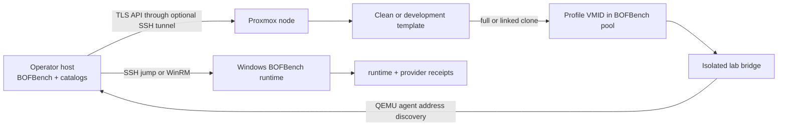

# Proxmox-Native Windows Labs

BOFBench can treat a Proxmox VM as a portable lab profile without hard-coding a host address into a BOF project. The provider owns clone, power, snapshot, restore, template, and teardown for one configured VMID. SSH or WinRM remains the Windows transport after the guest starts.



## Resource ownership

Use a dedicated pool, VMID range, bridge, and API token. BOFBench does not enumerate a cluster and claim arbitrary resources. It operates only on the node, VMID, pool, storage, bridge, and template recorded in the selected profile.

Recommended boundaries:

| Resource | Example | Purpose |
| --- | --- | --- |
| pool | `bofbench` | Lifecycle and audit boundary. |
| VMID range | `4100-4199` | Avoid collision with other lab owners. |
| bridge | `vmbr290` | Isolated Windows lab segment. |
| subnet | `10.12.90.0/24` | Guest discovery filter and optional NAT scope. |
| API role | VM lifecycle + pool/storage + exact bridge use | No global administrator token. |

The repository includes scoped network service units under `infra/proxmox`. They configure DHCP/DNS and NAT only for the selected bridge. Do not copy them onto a shared host without substituting the bridge, subnet, and outbound interface from your resource plan.

## Prepare credentials outside the profile

Create a Proxmox API token whose secret is resolved from an environment variable or the macOS Keychain. Store only the token ID and the secret source in the non-secret preparation file:

```json
{
  "schema": "bofbench.proxmox-preparation",
  "schema_version": 1,
  "endpoint": "https://<PROXMOX_HOST>:8006/api2/json",
  "node": "<NODE>",
  "pool": "bofbench",
  "storage": "local-lvm",
  "iso_storage": "local",
  "token_id": "<USER>@pve!<TOKEN>",
  "token_secret_source": {
    "kind": "macos-keychain",
    "service": "bofbench-proxmox-<HOST>",
    "account": "<USER>@pve!<TOKEN>"
  },
  "ca_file": "~/.config/bofbench/proxmox-ca.pem",
  "ssh_alias": "bofbench-proxmox",
  "resource_plan": {
    "vmid_min": 4100,
    "vmid_max": 4199,
    "management_bridge": "vmbr0",
    "lab_bridge": "vmbr290",
    "lab_subnet": "10.12.90.0/24",
    "lab_gateway": "10.12.90.1"
  }
}
```

The CA certificate is required. BOFBench does not offer an insecure TLS default. When the API is unreachable directly, `ssh_alias` creates a temporary local TLS tunnel while retaining certificate hostname validation.

## Build clean and development templates

The checked-in Windows assets provide reproducible starting points:

- `Autounattend.xml.tmpl` installs Windows 11 without embedding a repository password.
- `tools/autounattend` creates a transient answer ISO from a password supplied in `BOFBENCH_WINDOWS_TEMPLATE_PASSWORD` and an external SSH public key.
- `provision.ps1` installs QEMU guest tools, OpenSSH, WinRM, the PowerShell SSH default shell, long-path support, and a template marker.
- `dev-tools.ps1` adds MSVC Build Tools, Windows SDK, Go, WinDbg, and MinGW x64/x86 to a cloned development image.

Example answer-media creation:

```bash
export BOFBENCH_WINDOWS_TEMPLATE_PASSWORD=@prompted-outside-shell
export BOFBENCH_WINDOWS_SSH_PUBLIC_KEY_FILE="$HOME/.ssh/bofbench-windows.pub"
go run ./infra/proxmox/tools/autounattend \
  --upload bofbench-proxmox:/var/lib/vz/template/iso/bofbench-win11-autounattend.iso
unset BOFBENCH_WINDOWS_TEMPLATE_PASSWORD
```

Use your own licensed Windows ISO. Attach the Windows, VirtIO, and transient answer media only for installation. Before template conversion:

1. Verify `C:\ProgramData\BOFBench\template-ready.json` through the guest agent.
2. Verify QEMU agent, OpenSSH key access, and WinRM.
3. Detach all installation media.
4. Delete the transient answer ISO.
5. Convert the stopped VM to a template.

The clean image supports `build_mode=local` and therefore needs no compiler. Clone it, run `dev-tools.ps1`, verify `dev-template-ready.json`, stop it, and convert that clone to the development template.

Windows Server and domain-member templates follow the same provider lifecycle, but they are accepted only when licensed Server media is present. A missing Server ISO is reported as unavailable topology coverage, not simulated success.

List provider media and build only the exact BOFBench-owned VMID selected by the operator:

```bash
bofbench lab media list --provider proxmox \
  --proxmox-prep ~/.config/bofbench/proxmox-lab.json
bofbench lab template status --lab proxmox-domain-dc
bofbench lab template build --lab proxmox-domain-dc \
  --vmid 4102 --name bofbench-windows-server-template \
  --iso local:iso/windows-server.iso --memory-mb 4096 --cores 4
```

`media list` is read-only. `template build` rejects VMIDs outside the preparation file's reserved range and does not overwrite an existing guest. After Windows installation and guest preparation, use `lab template convert` only on the selected stopped VM.

## Runtime control planes

Sliver and licensed Cobalt Strike infrastructure are modeled separately from Windows lab profiles. A runtime-control profile contains the provider preparation reference, exact VMID, template VMID, clone mode, and runtime type; it contains no operator credential, Team Server secret, listener, or implant material.

```bash
bofbench runtime control add sliver-lab \
  --runtime sliver --provider proxmox \
  --proxmox-prep ~/.config/bofbench/proxmox-lab.json \
  --vmid 4120 --template-vmid 4104
bofbench runtime control up sliver-lab
bofbench runtime control status sliver-lab
```

The repository's `infra/proxmox/linux` assets pin the control-plane software and verify its server archive hash. They install a disabled-by-default service surface: operators and sessions are created outside the repository. No public listener is configured by BOFBench.

Once the control plane and selected Windows profile are ready, create a disposable session and remove it after the proof lane:

```bash
bofbench sliver lab-session start \
  --control sliver-lab --lab proxmox-dev --arch x64 --context user
bofbench runtime status --lab proxmox-dev
bofbench sliver lab-session stop --lab proxmox-dev --cleanup
```

The session receipt records control/profile identities, architecture, requested context, session/task identifiers, hashes, timestamps, and cleanup. Implant bytes and server credentials are not serialized.

## Register a profile

```bash
bofbench lab add proxmox-dev \
  --provider proxmox \
  --proxmox-prep ~/.config/bofbench/proxmox-lab.json \
  --proxmox-vmid 4110 \
  --proxmox-template-vmid 4101 \
  --proxmox-clone-mode full \
  --transport ssh \
  --user Administrator \
  --identity ~/.ssh/bofbench-windows \
  --remote-root 'C:\bofbench' \
  --build-mode remote
```

`lab show` prints only non-secret connection and provider data. The guest address may remain empty because BOFBench discovers it after startup:

```bash
bofbench lab show proxmox-dev
bofbench lab provider status --lab proxmox-dev
```

## Lifecycle and receipts

```bash
bofbench lab up --lab proxmox-dev
bofbench lab bootstrap --lab proxmox-dev
bofbench lab status --lab proxmox-dev
bofbench lab snapshot clean --lab proxmox-dev
bofbench lab restore clean --lab proxmox-dev
bofbench lab down --lab proxmox-dev
```

If the profile VMID is absent, `lab up` first clones the configured template. Proxmox asynchronous actions are followed to their terminal UPID state. Each action writes `runs/<id>/provider.json` with the provider, profile, action, VMID, task ID, task state, guest identity, timestamps, and error. Token secrets are never serialized.

Use `lab stop --force` only when graceful guest shutdown cannot complete. `lab destroy` removes only the selected profile VMID and requires the provider's explicit destroy action; it never touches the source template.

## Build and run

```bash
bofbench new posture --pack filesystem-and-smb-posture
bofbench build bofs/posture --arch x64
bofbench analyze bofs/posture
bofbench run bofs/posture --via lab --lab proxmox-dev
```

For a compiler-free clone, change the profile to `--build-mode local`. BOFBench builds on the operator host, uploads the exact object and Windows runtime, and records both hashes. Development images can use `remote` or `auto` to exercise MSVC and MinGW on Windows.

## Standalone and domain topologies

Topology definitions contain profile names only:

```bash
bofbench lab topology add proxmox-standalone \
  --execution devbox \
  --target proxmox-member

bofbench lab topology up proxmox-standalone
bofbench lab topology status proxmox-standalone
```

For a domain topology, add the domain-controller profile after Server media and a DC template are available:

When creating the Server installation VM, pass the exact VirtIO driver ISO with `lab template build --driver-iso ...` so Windows Setup can load the BOFBench template disk and network drivers without any host-wide Proxmox change.

```bash
bofbench lab topology add proxmox-domain \
  --execution devbox \
  --target proxmox-member \
  --domain-controller proxmox-dc

bofbench lab topology up proxmox-domain
bofbench lab topology snapshot proxmox-domain --snapshot clean-domain
```

Provision the already registered DC and member roles with a transient password source:

```bash
bofbench lab topology provision proxmox-domain \
  --domain bofbench.test --netbios BOFBENCH --credential @prompt
bofbench lab topology verify proxmox-domain
```

Provisioning uses Windows AD DS deployment commands on the DC, follows required reboots, joins member roles, creates the disposable `OU=BOFBench` proof container, and writes role-specific receipts containing no password. Re-running it verifies the intended state and applies only missing steps.

## Ordered target sets

Topology version 2 adds explicitly named, ordered sets. Nothing discovered by a pack is automatically tasked:

```bash
bofbench lab topology target add proxmox-standalone \
  --set windows-targets --lab proxmox-target-a
bofbench lab topology target add proxmox-standalone \
  --set windows-targets --lab proxmox-target-b
bofbench lab topology target list proxmox-standalone

bofbench operation run internal/multi-target-remote-triage \
  --catalog ~/bofbench-packs-internal \
  --via lab --topology proxmox-standalone --targets windows-targets
```

Operation schema v11 expands the selected set into finite per-target branches. Receipts retain ordered target resolution, actual computer identity, exact object hash, effects, errors, captures, and per-target cleanup. Resume skips completed targets; cleanup reverses only completed stateful branches.

Startup order is domain controller, target, execution. Shutdown and cleanup reverse the order. Existing-provider roles are observed but never powered or destroyed by BOFBench.

### Prepare a standalone Windows target

The clean target can remain compiler-free: use `build_mode=local` and let BOFBench upload the exact object and runtime. Enable only the Windows surfaces required by the proof lane on the isolated bridge. SMB/WMI cross-host proof typically needs File and Printer Sharing, Windows Management Instrumentation, remote service management, and Remote Registry when registry packs are selected. Record the original service and firewall state and restore the clean snapshot when the lane completes.

Standalone local-administrator authentication is additionally affected by Windows remote UAC filtering. In a disposable, snapshot-backed lab, `LocalAccountTokenFilterPolicy=1` permits the explicitly supplied local administrator token to reach admin shares and remote management APIs. Do not make that a global template default; prefer domain credentials in a managed topology and restore the target snapshot after standalone acceptance.

The two-guest flow remains direct BOFBench operation:

```bash
bofbench lab topology add proxmox-standalone \
  --execution proxmox-dev --target proxmox-target
bofbench lab topology up proxmox-standalone
bofbench lab bootstrap --lab proxmox-dev
bofbench lab bootstrap --lab proxmox-target
bofbench lab topology status proxmox-standalone

bofbench operation run internal/multi-target-remote-triage \
  --catalog ~/bofbench-packs-internal \
  --via lab --lab proxmox-dev --parallelism 4 \
  --arg targets=BOFBENCH-CLEAN \
  --arg auth_mode=new_credentials --arg domain=. \
  --arg username=@env:BOFBENCH_TARGET_USER --arg password=@prompt
```

Provider receipts prove which VMs ran; operation/runtime receipts prove the exact object, fan-out item, redacted authentication fields, WMI result, and terminal state.

## Troubleshooting

- **API timeout:** configure the preparation file's SSH alias and verify the Proxmox CA still identifies the real endpoint.
- **`SDN.Use` denied:** grant the token and its owning user the exact bridge-use role; do not broaden to global administrator.
- **VM appears absent after clone:** wait for pool membership propagation and run `lab provider status` again. The source template must remain in the same permitted pool.
- **No guest address:** verify the QEMU agent and that `guest_ipv4_cidr` matches the isolated subnet.
- **SSH reaches `cmd.exe`:** set the Windows OpenSSH `DefaultShell` to Windows PowerShell; the supplied provisioner does this.
- **Host-key mismatch after replacing a disposable VMID:** use a profile-specific `known_hosts` file and remove only the old entry for that profile address after independently verifying the replacement.
- **Remote compiler unavailable:** switch the profile to local-build mode or use the development template.
- **Remote target reports access denied:** verify the isolated-lab firewall groups, supplied credential context, and standalone remote-UAC policy; do not weaken the shared Proxmox host or unrelated guests.
- **SMB connection cleanup appears absent:** network-use mappings belong to the originating Windows logon session. Perform open/close in the same native or C2 session, or restore the disposable VM snapshot after lab proof.
- **Server/domain unavailable:** provide licensed Server media and build the template; BOFBench keeps the static topology configuration but reports live coverage as unavailable.

Related: [Portable Lab Profiles](lab-profiles.md), [Lab Architecture](lab-setup.md), [Multi-Host Topologies](scenarios/topologies.md), and [Fan-Out SMB and NTFS](scenarios/fanout-smb-ntfs.md).
