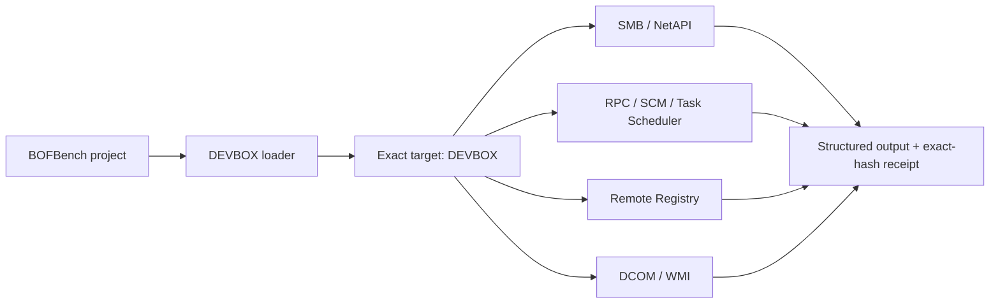

# Standalone Remote Operations

BOFBench can exercise Windows network-management paths against one exact hostname even when the operator runtime and target are the same authorized machine. This is useful before a second host or domain lab is ready: the BOF still uses named-host SMB, RPC, Service Control Manager, Task Scheduler, Remote Registry, and DCOM/WMI connections.

!!! important "What this proves"
    Results against `DEVBOX` prove the named network path and native Windows API behavior. They are **standalone network-path proof**, not cross-host, lateral-movement, or domain proof.



Use only a Windows host you own or are explicitly authorized to test. These packs do not discover targets, scan a subnet, reuse credentials, or propagate.

## Prepare the disposable fixture

```bash
bofbench lab status --lab devbox
bofbench lab target deploy --lab devbox
bofbench lab target status --lab devbox
```

The target report includes the actual Windows computer name, the exact HKLM canary key/value and expected hash, the admin-share staging root, and unique task/file names used by declarative proofs. If Remote Registry was disabled or stopped, deployment records that state so removal can restore it exactly.

## Read-only host, service, and task inventory

```bash
bofbench new remote-host --pack remote-host-info
bofbench run bofs/remote-host --via lab --lab devbox \
  --arg target_host=DEVBOX

bofbench new remote-services --pack remote-service-inventory
bofbench run bofs/remote-services --via lab --lab devbox \
  --arg target_host=DEVBOX \
  --arg name_filter=BOFBench \
  --arg state_filter=running \
  --arg result_limit=16

bofbench new remote-tasks --pack remote-task-inventory
bofbench run bofs/remote-tasks --via lab --lab devbox \
  --arg target_host=DEVBOX \
  --arg name_filter=BOFBench \
  --arg result_limit=16
```

The inventory packs are public, bounded, and read-only. Output names the exact target on every result line.

## Query SMB sessions and one registry value

```bash
bofbench new remote-sessions --pack internal/remote-session-inventory
bofbench run bofs/remote-sessions --via lab --lab devbox \
  --arg target_host=DEVBOX \
  --arg client_filter='' \
  --arg user_filter='' \
  --arg result_limit=16

bofbench new remote-registry --pack internal/remote-registry-read
bofbench run bofs/remote-registry --via lab --lab devbox \
  --arg target_host=DEVBOX \
  --arg hive=HKLM \
  --arg key_path='Software\BOFBench' \
  --arg value_name=RemoteCanary \
  --arg max_bytes=128
```

The registry pack connects to the named host, reads only the supplied hive/key/value, and emits a bounded SHA-256-tagged payload. The live bytes are visible to the operator; the declared `hex` field is redacted from stored receipts and proof reports.

## Run one bounded WMI query

```bash
bofbench new remote-wmi --pack internal/remote-wmi-query
bofbench run bofs/remote-wmi --via lab --lab devbox \
  --arg target_host=DEVBOX \
  --arg namespace='ROOT\CIMV2' \
  --arg query='SELECT Caption FROM Win32_OperatingSystem' \
  --arg property=Caption \
  --arg result_limit=4
```

The pack constructs `\\DEVBOX\ROOT\CIMV2`, applies the current authorized security context, and stops at the supplied result limit.

## Stage and remove one hash-matched file

```bash
bofbench new remote-stage --pack internal/remote-file-stage
bofbench run bofs/remote-stage --via lab --lab devbox \
  --arg target_host=DEVBOX \
  --arg share='C$' \
  --arg relative_path='bofbench\proof\operator-canary.bin' \
  --arg content=/absolute/path/to/operator-canary.bin \
  --arg content_sha256=<SHA256> \
  --arg overwrite=0

bofbench run bofs/remote-stage --via lab --lab devbox --cleanup \
  --arg target_host=DEVBOX \
  --arg share='C$' \
  --arg relative_path='bofbench\proof\operator-canary.bin' \
  --arg content_sha256=<SHA256>
```

Staging refuses content whose supplied hash does not match. Cleanup re-hashes the existing remote file and refuses deletion when the digest differs, so it cannot silently remove changed content.

## Execute and clean one exact remote task

```bash
bofbench new remote-task --pack internal/remote-task-execute
bofbench run bofs/remote-task --via lab --lab devbox \
  --arg target_host=DEVBOX \
  --arg task_name=BOFBench-RemoteProof \
  --arg command='C:\Windows\System32\cmd.exe' \
  --arg arguments='/d /c whoami > C:\bofbench\proof\remote-task.txt' \
  --arg working_directory='C:\Windows\System32' \
  --arg timeout_seconds=20

bofbench run bofs/remote-task --via lab --lab devbox --cleanup \
  --arg target_host=DEVBOX \
  --arg task_name=BOFBench-RemoteProof
```

This uses native Task Scheduler COM interfaces, not `schtasks.exe`. The action waits for a bounded task result; cleanup deletes only the exact supplied task name.

## Prove the declared cases

```bash
bofbench pack prove remote-host-info --via lab --lab devbox
bofbench pack prove remote-service-inventory --via lab --lab devbox
bofbench pack prove remote-task-inventory --via lab --lab devbox

bofbench pack prove internal/remote-registry-read --via lab --lab devbox
bofbench pack prove internal/remote-file-stage --via lab --lab devbox
bofbench pack prove internal/remote-task-execute --via lab --lab devbox
```

Each state-changing proof observes the named artifact after execution, invokes its cleanup companion, and checks absence through the independent SSH lab transport.

## Restore the host

```bash
bofbench lab target remove --lab devbox
bofbench lab verify clean --lab devbox
```

Removal deletes the exact registry canary and staging root created by the fixture, removes `BOFBenchTarget`, and restores Remote Registry to its recorded start mode and running state.
