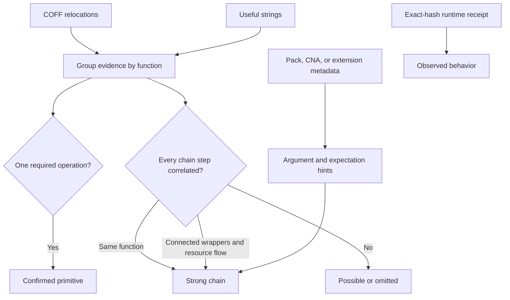

# Read a Capability Report

The default analysis is ordered for an operator: abilities first, requirements second, runtime support third, structural loader detail last.

## Example

```bash
bofbench analyze arsenal/trustedsec-sa/SA/whoami/whoami.x64.o
```

Representative summary:

```text
BOF ANALYSIS PASS
object  arsenal/trustedsec-sa/SA/whoami/whoami.x64.o
format  COFF x64

Can do
  • inspect current identity and token context
  • query process and token information

Needs
  • Windows x64
  • current process token access

Effects
  • reads identity and security-token metadata

Works with
  • native loader
  • Sliver and Cobalt Strike BOF packages
```

This says the object can inspect identity. It does not claim token duplication, impersonation, credential recovery, or process creation unless the necessary function-local chains are present.

## Confidence

| Confidence | Meaning | Operator interpretation |
| --- | --- | --- |
| `confirmed primitive` | One operation is directly evidenced | The object contains the named API-level ability |
| `strong chain` | Every required step occurs in one function or a connected, resource-correlated call chain | The related multi-step behavior is strongly supported |
| `possible` | Evidence is incomplete or spread ambiguously | Inspect source, strings, arguments, and runtime evidence before relying on it |



## Needs and effects

`Needs` describes conditions, not blockers invented by BOFBench. It can include:

- A PID, TID, address, path, hostname, SPN, or query.
- Windows access rights or elevation.
- A domain, network path, or named runtime session.
- Architecture or loader support.

`Effects` separates read-only discovery from process access, state mutation, execution, persistence, authentication-material access, and remote reach.

## Arguments

Arguments may come from a pack lock, `extension.json`, Aggressor script, source usage of Beacon data functions, or observed metadata. Prefer a manifest/C2 contract over inferred parser order when both are available.

```text
Arguments
  target_pid   int      required  source=pack lock
  filter       string   optional  source=pack lock
  payload      file     required  source=pack lock
```

## Loader support

Loader support explains whether the object can be resolved and entered by BOFBench's native loader. `compatible` does not mean that the requested Windows operation will succeed under every token or target condition. A loader failure is different from an operation returning `access denied`.

Use more detail when needed:

```bash
bofbench analyze object.x64.o --format md
bofbench analyze object.x64.o --format json
bofbench analyze object.x64.o --loader-details
```

Use a focused explanation when a report has several chains:

```bash
bofbench analyze object.x64.o --explain token-impersonation
```

Analysis v3 reports `evidence_functions`, `interprocedural`, and `resource_flows`. A cross-function chain is strong only when the functions are call-connected and the relevant produced/consumed resource is correlated; two unrelated functions with convenient imports are not combined.

## Observed evidence

After execution, rerun analysis:

```bash
bofbench run bofs/survey --via lab --lab devbox --arg result_limit=10
bofbench analyze bofs/survey
```

Observed output appears only when a receipt contains the same object SHA-256. Rebuilding after a source change produces a different object and therefore a separate observation history.

## Compare two objects

```bash
bofbench analyze first.x64.o --compare second.x64.o --format md
```

Read capability and argument differences before import-count or size changes. A hash change with no behavioral difference can be a rebuild; an added behavior chain or changed argument contract is operationally meaningful.
