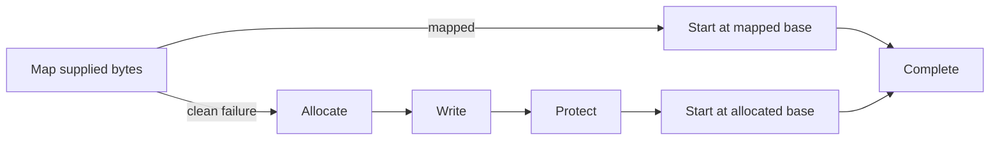

# Adaptive Native Coordination

## Objective and resulting capability

Inspect Windows coordination state, exercise named kernel objects and callback mechanisms, and run a result-routed memory operation. This scenario demonstrates why an operation route is useful: section mapping is preferred, while a complete and explicitly reported mapping failure can select allocation, write, protect, and thread-start as a fallback.

The operator still supplies the PID, object names, limits, and payload. Disposable holders, child processes, and return payloads are proof infrastructure only.

## Prerequisites

- BOFBench and the internal catalog are available.
- `devbox` is a reachable, authorized Windows lab profile.
- The selected architecture matches the target process and payload.
- The selected context can inspect or modify the requested process and kernel objects.

Check the environment before running:

```bash
bofbench lab status --lab devbox
bofbench pack test thread-wait-chain-inventory
bofbench operation test internal/adaptive-memory-execute \
  --catalog ~/bofbench-packs-internal --compiler mingw
```

## Triage a process wait chain

```bash
bofbench new coordination-triage --pack process-image-inventory,thread-state-inventory,process-handle-type-summary,thread-wait-chain-inventory
bofbench build bofs/coordination-triage --arch x64
bofbench analyze bofs/coordination-triage
bofbench run bofs/coordination-triage --via lab --lab devbox \
  --arg target_pid=1234 \
  --arg target_tid=0 \
  --arg result_limit=64
```

`target_tid=0` asks the wait-chain pack to inspect bounded threads owned by the selected PID. Use an exact TID to narrow the result. The capability report should identify process images, thread state, per-type handle counts, and Wait Chain Traversal rather than only listing imports.

Representative structured output:

```text
[process-handle-type-summary] target_pid=1234 type_index=5 type=Event count=11
[process-handle-type-summary] status=complete target_pid=1234 shown=8 limit=64
[thread-wait-chain-inventory] target_pid=1234 target_tid=5678 node=0 kind=thread pid=1234 tid=5678 status=2 cycle=0
[thread-wait-chain-inventory] status=complete target_pid=1234 target_tid=0 shown=6 limit=64
```

A wait-chain node is coordination evidence, not automatically a deadlock. Compare thread state, object nodes, and `cycle` before drawing that conclusion.

## Inspect the adaptive route

```bash
bofbench operation show internal/adaptive-memory-execute
bofbench operation graph internal/adaptive-memory-execute
bofbench operation graph internal/adaptive-memory-execute --format mermaid
```

The route is forward-only:



Only a complete `[process-section-map] status=failed` result may select `allocate`. A loader exception, runtime timeout, or incomplete C2 task stops and remains inspectable; BOFBench does not assume whether the mapping had an effect.

## Run the primary route

```bash
bofbench operation run internal/adaptive-memory-execute \
  --catalog ~/bofbench-packs-internal \
  --via lab --lab devbox --arch x64 --cleanup \
  --arg target_pid=1234 \
  --arg payload=@file:/absolute/path/payload.bin \
  --arg payload_size=256 \
  --arg payload_sha256=<SHA256> \
  --arg section_protection=32 \
  --arg wait_ms=5000
```

Expected route fields in `runs/<run-id>/operation.json`:

```json
{
  "status": "completed",
  "actual_path": ["map", "section-start"],
  "skipped_steps": ["allocate", "write", "protect", "fallback-start"]
}
```

The `map` step records `matched_outcome=mapped`, captures the remote base, and pins `next_step=section-start`. Cleanup invokes the exact section-unmap companion for that captured process/base.

## Prove both declared paths

```bash
bofbench operation prove internal/adaptive-memory-execute \
  --catalog ~/bofbench-packs-internal \
  --via lab --lab devbox --arch x64
```

The primary proof uses a disposable process and benign return payload. The fallback proof supplies a deliberately unsupported section protection so the pack returns a controlled, complete failure before routing. It then proves allocation, write, protection, thread start, and exact memory cleanup. Each proof compares its `actual_path` with `expect_path`.

## Coordinate named objects

Use generated proof fixtures:

```bash
bofbench operation prove internal/named-event-lifecycle \
  --catalog ~/bofbench-packs-internal --via lab --lab devbox --arch x64
bofbench operation prove internal/shared-section-roundtrip \
  --catalog ~/bofbench-packs-internal --via lab --lab devbox --arch x64
bofbench operation prove internal/job-contained-process \
  --catalog ~/bofbench-packs-internal --via lab --lab devbox --arch x64
```

For ordinary operation, inspect each definition with `operation show` and supply your own holder PID, member PID, object name, content, and limits. Independent proof checks query the event state, section hash, job membership, and retained handles without changing what they inspect.

## Exercise callback mechanisms

```bash
bofbench operation run internal/callback-execution-matrix \
  --catalog ~/bofbench-packs-internal \
  --via lab --lab devbox --arch x64 \
  --arg payload=@file:/absolute/path/payload.bin \
  --arg due_ms=1 --arg timeout_ms=5000 --arg free_after=1
```

This executes the supplied bytes independently through a timer queue, IO completion worker, and queued work item. Each step must report `status=complete`; a failure does not advance to the next callback primitive.

## Receipts, recovery, and cleanup

```bash
bofbench operation resume runs/<run-id>/operation.json
bofbench operation cleanup runs/<run-id>/operation.json
```

Inspect `matched_outcome`, `actual_path`, `skipped_steps`, step object hashes, and nested runtime receipts. Resume preserves the selected path. Cleanup touches only completed stateful steps in reverse execution order.

Common failures:

- `no outcome matched`: the pack returned a complete result not described by the operation; update the definition only after inspecting it.
- `runtime task ... failed`: no fallback is selected because effects are unknown.
- object open denied: verify scope (`Local\` or `Global\`), exact name, and the selected security context.
- section mapping invalid parameter: check size, range, and architecture; arbitrary offsets are aligned internally.
- job assignment denied: the process may already belong to a non-breakaway job.

Related: [adaptive operations](../operations.md), [runtime evidence](../evidence.md), [pack testing and proof](../pack-testing.md), and [generated operation reference](../operation-reference.md).
