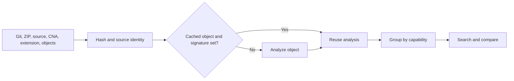

# Build and Search an Arsenal

## Objective

Acquire an external BOF repository, pin its source and objects, build a capability index, search in operator language, and detect later regressions.

<video class="bb-video-clip" controls preload="metadata" poster="../../assets/images/arsenal-search.png">
  <source src="../../assets/media/arsenal-search.webm" type="video/webm">
</video>

## Acquire and lock

```bash
bofbench arsenal acquire <GIT_OR_ZIP_URL> --name public-bofs
bofbench arsenal lock arsenal/public-bofs
bofbench arsenal verify arsenal/public-bofs
```

The lock records repository revision, discovered object paths, architecture, and hashes. Verification detects missing, added, or changed objects.

## Inventory capabilities

```bash
bofbench arsenal inventory arsenal/public-bofs
```



## Search

```bash
bofbench arsenal search arsenal/public-bofs --can token
bofbench arsenal search arsenal/public-bofs --effect starts-execution --arch x64
bofbench arsenal search arsenal/public-bofs --works-with sliver --has-args
bofbench arsenal search arsenal/public-bofs --requires admin
```

Choose a result by capability, confidence, arguments, effects, and runtime support. Use size or import count only after those operator concerns.

## Compare candidates

```bash
bofbench arsenal compare arsenal/public-bofs --can process
bofbench analyze <FIRST_OBJECT> --compare <SECOND_OBJECT> --format md
```

## Refresh efficiently

```bash
git -C arsenal/public-bofs pull --ff-only
bofbench arsenal diff arsenal/public-bofs
bofbench arsenal inventory arsenal/public-bofs
```

Unchanged object/signature keys reuse the index. Changed objects are reanalyzed. Review capability and argument changes before accepting the new lock.

## Regression acceptance

```bash
bofbench arsenal regression \
  runs/<before>/arsenal-inventory.json \
  runs/<after>/arsenal-inventory.json
```

A hash-only change is reported separately from removed capability, changed argument contract, or loader incompatibility.

## Failure recovery

- Acquisition failed: verify URL, branch, proxy, and archive format.
- Lock mismatch: run `diff`; do not overwrite the lock until changes are understood.
- Missing arguments: locate adjacent `.cna`, `extension.json`, or source.
- Ambiguous behavior: compare source and function-local relocation evidence.
