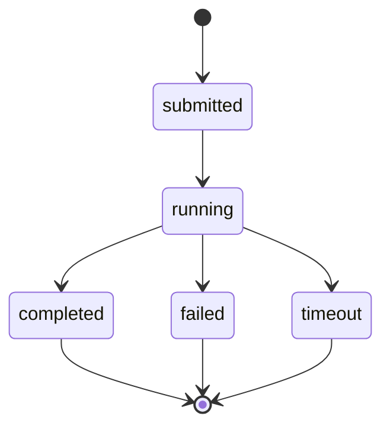

# Operate Sliver Sessions and Tasks

## Objective

Bind Sliver to a named lab profile, execute a project, follow complete task state, and resume only incomplete proof cases.

<video class="bb-video-clip" controls preload="metadata" poster="../../assets/images/runtime-tasks.png">
  <source src="../../assets/media/runtime-tasks.webm" type="video/webm">
</video>

## Check setup and sessions

```bash
bofbench sliver setup --lab devbox
bofbench runtime status --lab devbox
bofbench runtime sessions --via sliver --lab devbox
```

Install `coff-loader` only through explicit setup:

```bash
bofbench sliver setup --lab devbox --install
```

The selected session must match the profile selector and expected Windows computer/user context.

## Wait for a reconnecting session

```bash
bofbench runtime wait --via sliver --lab devbox --timeout 10m
```

Unavailable means no matching live session was present. It is not converted into a pass.

## Execute a project

```bash
bofbench run bofs/first-survey --via sliver --lab devbox \
  --arg root_pid=0 --arg result_limit=10
```



## Follow tasks

```bash
bofbench runtime tasks --via sliver --lab devbox
bofbench runtime task <TASK_ID> --wait --timeout 10m
bofbench runtime watch --via sliver --lab devbox --timeout 10m
```

Require a terminal state and `output_complete=true` for a live pass. Retain task ID, session ID, object hash, and receipt path.

## Run and resume catalog proof

```bash
bofbench pack prove --all --catalog ~/bofbench-packs-internal \
  --via sliver --lab devbox

bofbench pack prove --all --catalog ~/bofbench-packs-internal \
  --via sliver --lab devbox \
  --resume runs/<prior-proof>/pack-proof.json \
  --only failed,unavailable
```

Context-specific cases may remain unavailable if the session user differs from the required proof fixture user. Ordinary task failures remain failures.

## Cleanup verification

When a proof changes state, BOFBench invokes declared cleanup and verifies through the lab transport rather than trusting C2 output alone.
