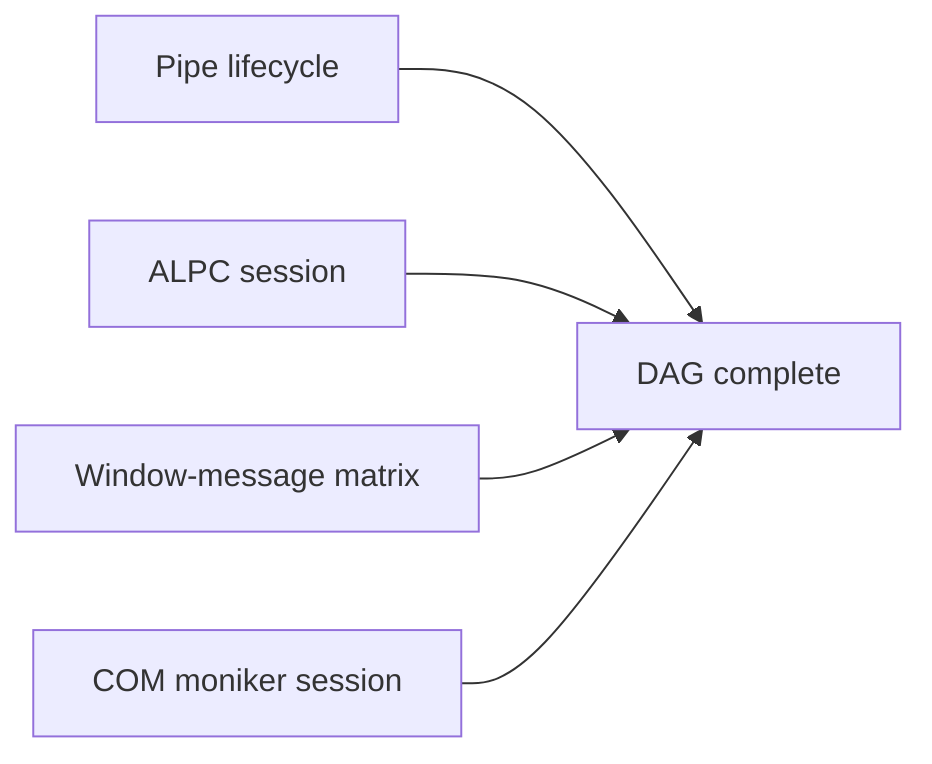

# Run a Dependency-Aware IPC Operation

## Objective

Use a version-6 DAG operation to exercise independent named-pipe, ALPC, window-message, and COM lanes on a named Windows lab. Use this when the work has real dependencies and independent roots that should run concurrently without encoding a hand-written wrapper.

## Resulting capability

The `internal/ipc-dependency-matrix` operation:

- opens and transacts through an exact named pipe;
- connects to and exchanges bytes through an exact ALPC port;
- discovers one exact operator-context custom window, then sends synchronous, asynchronous, and `WM_COPYDATA` messages while using a separate exact text-control HWND for `WM_SETTEXT`;
- inspects COM registration, binds an exact moniker, and invokes an exact typed member;
- captures retained handles, the fixture HWND, and the resolved COM class;
- optionally closes retained pipe and ALPC handles in reverse topological order.

## Prerequisites

- BOFBench and the private catalog configured.
- A ready Windows profile named `devbox`.
- The disposable proof target deployed for the fixture values.
- MinGW locally or MSVC on the lab.

```bash
bofbench catalog add /Users/keys/Documents/bofbench-packs-internal \
  --name internal
bofbench lab status --lab devbox
bofbench lab target deploy --lab devbox
bofbench lab target status --lab devbox
```

The target status provides the holder PID, pipe name, ALPC port, custom window class, text-window handle, and custom message IDs. The window fixtures run under a disposable passwordless S4U task for the configured operator; the privileged process and handle fixtures remain in the LocalSystem service. These are proof fixtures; normal operation inputs can be operator-selected values.

## Inspect the dependency graph

```bash
bofbench operation show internal/ipc-dependency-matrix --expand
bofbench operation graph internal/ipc-dependency-matrix --expand
bofbench operation graph internal/ipc-dependency-matrix \
  --expand --format mermaid
```

The parent has four independent roots:



Each child contains its own dependencies. For example, the window child must capture the HWND before its four message steps become ready.

## Portable static test

```bash
bofbench operation test internal/ipc-dependency-matrix \
  --catalog /Users/keys/Documents/bofbench-packs-internal \
  --compiler mingw
```

The test validates the v6 graph, builds every unique x64/x86 pack, evaluates analyzer expectations, and verifies raw, Sliver, and Cobalt Strike exports. It does not claim live C2 execution.

## Live declared proof

```bash
bofbench operation prove internal/ipc-dependency-matrix \
  --catalog /Users/keys/Documents/bofbench-packs-internal \
  --via lab --lab devbox --arch x64 --parallelism 4
```

Repeat with `--arch x86` for the separate x86 loader/helper. The proof resolves fixture placeholders and verifies:

- the parent ready wave contains `pipe`, `alpc`, `window`, and `com`;
- each child reaches a complete result contract;
- pipe and ALPC response hashes match the generated request;
- `WM_COPYDATA` and window text match independent target state;
- retained handles are closed when cleanup is requested.

Expected receipt fields include:

```text
execution_mode: dag
topological_order: [pipe, alpc, window, com]
execution_waves[0]: [pipe, alpc, window, com]
max_concurrency: 4
steps[].state: completed
blocked_steps: []
```

## Run with explicit inputs

Create a bounded request and its hash:

```bash
printf 'BOFBench IPC request' > /tmp/bofbench-ipc-request.bin
shasum -a 256 /tmp/bofbench-ipc-request.bin
```

Then supply values from `lab target status`:

```bash
bofbench operation run internal/ipc-dependency-matrix \
  --catalog /Users/keys/Documents/bofbench-packs-internal \
  --via lab --lab devbox --arch x64 --parallelism 4 --cleanup \
  --arg holder_pid=<HOLDER_PID> \
  --arg pipe_name='<PIPE_NAME>' \
  --arg alpc_port='<ALPC_PORT>' \
  --arg window_class='<WINDOW_CLASS>' \
  --arg text_window_handle=<TEXT_WINDOW_HANDLE> \
  --arg send_message_id=<SEND_MESSAGE_ID> \
  --arg post_message_id=<POST_MESSAGE_ID> \
  --arg request=@file:/tmp/bofbench-ipc-request.bin \
  --arg request_sha256=<REQUEST_SHA256> \
  --arg text='BOFBench IPC text' \
  --arg com_identifier='Scripting.Dictionary' \
  --arg com_moniker='new:{EE09B103-97E0-11CF-978F-00A02463E06F}' \
  --arg com_member=Count \
  --arg timeout_ms=5000
```

## Inspect, resume, and clean

```bash
bofbench runtime tasks --via sliver --lab devbox
bofbench operation resume runs/<run-id>/operation.json --parallelism 4
bofbench operation cleanup runs/<run-id>/operation.json --parallelism 4
bofbench lab verify clean --lab devbox
```

If a C2 child is submitted or running, the parent remains incomplete. Resume refreshes that exact child runtime receipt before evaluating its result contract. A failure stops new scheduling; already-running independent roots finish and are recorded. Descendants become blocked rather than silently skipped.

## Common failures

- `capture is not from an ancestor`: the operation definition consumes a field outside its dependency ancestry.
- `no matching output tag`: the runtime completed, but the pack result contract did not match.
- `output_classification=partial`: refresh the runtime task; partial output never advances the DAG.
- `window shown=0`: confirm the proof target is running and the supplied class matches.
- pipe/ALPC hash mismatch: confirm the selected fixture is the echo endpoint and the request hash matches the file.

## Next commands

- [Inspect Runtime Receipts](receipts.md)
- [Refresh C2 Tasks](c2-task-refresh.md)
- [Compare an Arsenal Across Architectures](arsenal-architecture-matrix.md)
