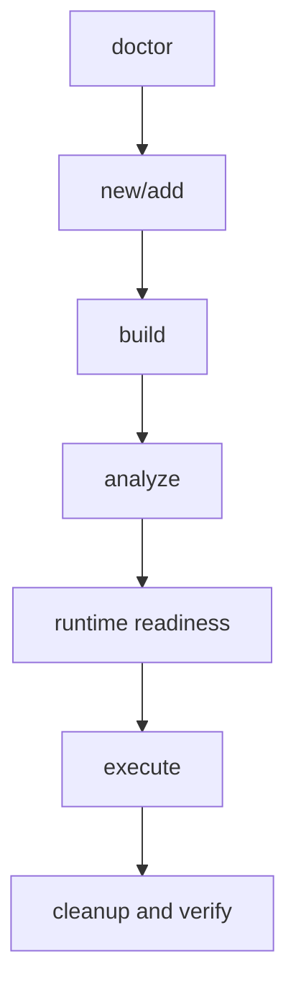

# Diagnose a Failed Workflow

## Objective

Identify whether a failure belongs to source, compilation, analysis, loader support, Windows access, transport, C2 task state, or cleanup.

## Start with the failing layer



Do not debug Windows privilege when the object did not compile. Do not modify loader code when execution entered the BOF and Windows returned access denied.

## Environment and compiler

```bash
bofbench doctor
bofbench build bofs/project --arch x64 --compiler mingw
```

Inspect generated source reports for unsupported Beacon API, implicit Windows imports, CRT dependencies, missing entrypoint, or linker assumptions.

## Analysis and loader

```bash
bofbench analyze dist/project.x64.o --loader-details
```

Separate malformed COFF, unsupported relocation, unresolved import, architecture mismatch, and entrypoint problems from the capability itself.

## Lab transport

```bash
bofbench lab show devbox
bofbench lab status --lab devbox
bofbench lab bootstrap --lab devbox
```

Test the same SSH or WinRM identity outside BOFBench when authentication fails. Retain host-key verification.

## C2 readiness and tasks

```bash
bofbench runtime status --lab devbox
bofbench runtime sessions --via sliver --lab devbox
bofbench runtime tasks --via sliver --lab devbox
bofbench runtime task <TASK_ID> --wait --timeout 10m
```

No matching session is unavailable coverage. A submitted task without complete output is incomplete. A terminal failure remains a failure.

## Operation errors

When structured output contains a Windows error:

- Confirm exact PID/TID/path/host still exists.
- Confirm object architecture matches target context.
- Confirm current token has the requested Windows rights.
- Confirm typed argument order and values from `pack show`.
- Rerun with a smaller result/output limit when transport bounds are involved.

## Cleanup

```bash
bofbench run bofs/project --via lab --lab devbox --cleanup <arguments>
bofbench lab verify clean --lab devbox
```

If cleanup fails, inspect the exact named artifact independently. Do not broaden deletion merely to make the proof report pass.
