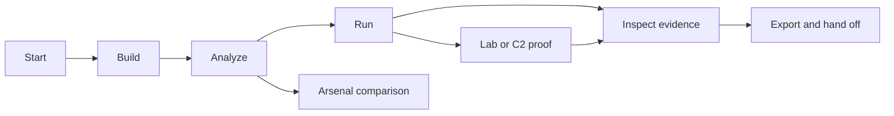

# Scenario Library

Use these walkthroughs when you want an outcome, not a command catalog. Each scenario names prerequisites, resulting capability, direct commands, expected output, evidence, variations, recovery, and next steps.

## Learn and build

| Scenario | Outcome |
| --- | --- |
| [Build and Run Your First BOF](first-bof.md) | Complete `new → build → analyze → run → export` workflow |
| [Build Across Architectures and Toolchains](build-matrix.md) | Equivalent x64/x86 and MinGW/MSVC objects |
| [Author and Prove an External Pack](external-pack.md) | Reusable capability with typed arguments and analyzer contract |
| [Package a Reproducible Handoff](release-handoff.md) | Verified package, evidence, and checksums for another operator |

## Analyze external BOFs

| Scenario | Outcome |
| --- | --- |
| [Explain TrustedSec `whoami`](trustedsec-whoami.md) | Operator-language explanation of a popular public BOF |
| [Compare Arbitrary Objects](arbitrary-object.md) | Behavioral and argument differences between unknown objects |
| [Build and Search an Arsenal](arsenal-workflow.md) | Locked, indexed, searchable external BOF corpus |

## Configure and operate runtimes

| Scenario | Outcome |
| --- | --- |
| [Move an Unchanged Project to Another VM](portable-vm.md) | Portable lab profiles with SSH or WinRM |
| [Bootstrap a Compiler-Free Windows Host](compiler-free-lab.md) | Local build, upload, native remote execution |
| [Execute Through Native and Lab Runtimes](runtime-execution.md) | Same object, typed arguments, and normalized receipts across adapters |
| [Inspect Receipts and Observed Behavior](receipts.md) | Exact-hash static/runtime correlation |
| [Operate Sliver Sessions and Tasks](c2-tasks.md) | Session selection, task completion, proof resumption |
| [Use the Operator TUI](tui-workflow.md) | Interactive composition, arguments, runtime, and results |

## Exercise capabilities

| Scenario | Outcome |
| --- | --- |
| [Run Public Host and Process Capabilities](public-capabilities.md) | Discovery, access, module exports, policy, and neighbors |
| [Operate Standalone and Domain Topologies](topologies.md) | Explicit multi-host roles and target selection |
| [Export for Native and C2 Runtimes](export-packages.md) | Raw, Sliver, and Cobalt Strike packages |
| [Compose Native IPC Operations](composable-native-ipc.md) | Nested synchronization and mailslot lifecycles with transitive receipts and cleanup |

## Recover and release

| Scenario | Outcome |
| --- | --- |
| [Diagnose a Failed Workflow](diagnose-workflow.md) | Structured compiler, loader, transport, session, and cleanup diagnosis |
| [Package a Reproducible Handoff](release-handoff.md) | Release archive and evidence verification |

