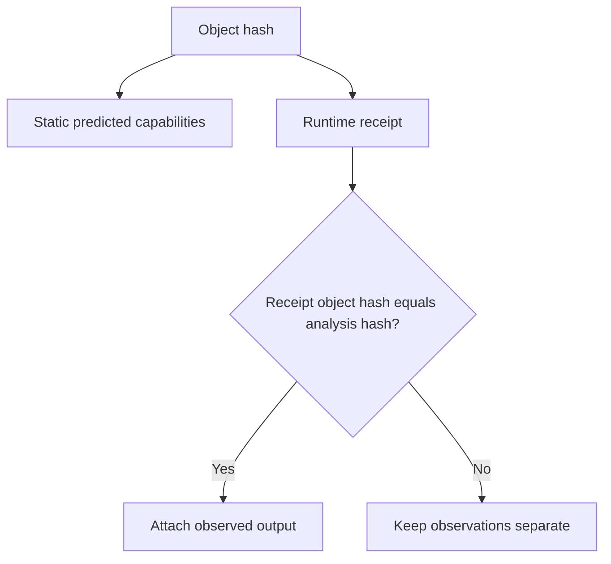

# Inspect Receipts and Observed Behavior

## Objective

Trace one project from static prediction through execution and exact-hash runtime evidence.

## Build and analyze

```bash
bofbench new receipt-survey --pack process-tree
bofbench build bofs/receipt-survey --arch x64
bofbench analyze bofs/receipt-survey --format json
```

Record the object SHA-256 from analysis.

## Execute

```bash
bofbench run bofs/receipt-survey --via lab --lab devbox \
  --arg root_pid=0 --arg result_limit=10
```

Every adapter writes `runs/<id>/result.json` using the runtime receipt schema.



## Inspect the receipt

Key fields include:

- Runtime, profile, remote computer, and architecture.
- Session and task IDs where applicable.
- `submitted`, `running`, `completed`, `failed`, or `timeout` state.
- Output-complete indicator.
- Object hash and typed argument names.
- Redacted sensitive argument/output field names.
- Output, exit state, duration, and error.

## Correlate observation

```bash
bofbench analyze bofs/receipt-survey
```

The `Observed` section appears only for matching object hashes. Change the source, rebuild, and analyze again to confirm the new object does not inherit prior observation.

## Sensitive data

Use supported secret sources:

```bash
bofbench run bofs/private-operation --via lab --lab devbox \
  --arg password=@prompt
```

The live command may display a recovered field when the pack contract permits it. Persisted receipts and proof reports store redacted field names, never sensitive argument values.

## Troubleshooting

- Missing receipt: inspect the run error and report directory printed by the command.
- Submitted forever: use `runtime task --wait`; do not label submission as completion.
- Observation absent: compare the receipt and analysis SHA-256 values.
- Wrong profile: inspect receipt `profile` and `target_computer` before relying on output.
