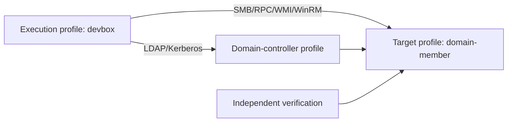

# Operate Standalone and Domain Topologies

## Objective

Use named profile roles for real cross-host and domain workflows without placing hosts or credentials in BOF projects.

## Register profiles

```bash
bofbench lab add devbox --provider existing --transport ssh \
  --host <EXECUTION_HOST> --user operator --remote-root 'C:\bofbench'
bofbench lab add dedicated --provider existing --transport ssh \
  --host <TARGET_HOST> --user operator --remote-root 'C:\bofbench'
bofbench lab add domain-dc --provider existing --transport winrm \
  --host <DOMAIN_CONTROLLER> --user administrator --remote-root 'C:\bofbench'
```

## Standalone topology

```bash
bofbench lab topology add dedicated-standalone \
  --execution devbox --target dedicated
bofbench lab topology status dedicated-standalone
```

Use exact host arguments for SMB, Registry, SCM, Task Scheduler, WMI, DCOM, and WinRM operations. The topology supplies role identity, not autonomous target discovery.

## Domain topology

```bash
bofbench lab topology add dedicated-domain \
  --execution devbox \
  --target domain-member \
  --domain-controller domain-dc
bofbench lab topology status dedicated-domain
```



## Explicit credential context

```bash
bofbench run bofs/remote-operation --via lab \
  --topology dedicated-domain \
  --arg target_host=<MEMBER_HOST> \
  --arg auth_mode=new_credentials \
  --arg domain=LAB \
  --arg username=@env:BOFBENCH_TARGET_USER \
  --arg password=@prompt
```

The bounded new-credentials token is used only for the named operation and is reverted afterward. Sensitive values are not persisted.

## Proof and teardown

```bash
bofbench pack prove --all --catalog ~/bofbench-packs-internal \
  --via lab --topology dedicated-domain
bofbench lab verify clean --lab domain-member
```

State-changing domain scenarios target the disposable member, not the domain controller. Review each receipt's role, target computer, and object hash.

## Recovery

- Role unavailable: inspect `topology status` for the specific profile.
- Authentication failure: verify credential source and remote protocol rights.
- Name resolution failure: use the exact resolvable computer/FQDN required by the API.
- Cleanup failure: independently inspect the target role and rerun the exact cleanup companion.
